# Architecture — `stratpoint_rag`

The chatbot half of the repository. `stratpoint_rag` is organized as one subpackage per pipeline concern: `rag` (corpus → chunks → embeddings → Chroma → `retrieve()` → grounded answer), `prompts` (the system-prompt variants and the `GroundedAnswer` contract), `docparse` (uploaded client brief → Markdown transcription → `ExtractedRequirements`), `disambiguation` (intent classification, slot extraction, clarification loop, the engagement naming ask), `guardrails` (input/output safety, plus an optional NeMo layer), `agent` (the ReAct loop, its tool contracts, and the guarded orchestrator that ties everything together), `llmops` (request telemetry), `api` (FastAPI), and `ui` (Streamlit). Dependencies flow inward toward `rag`: everything may import `rag`, `rag` imports only `prompts` and `llmops`, `llmops` imports nothing first-party, `docparse` imports only `rag.config` and `llmops`, and `prompts` never imports `rag` at runtime (only under `TYPE_CHECKING`). The `agent → docparse` direction is one-way and must not be inverted — `docparse` owns `ExtractedRequirements` and `agent/contracts.py` re-exports it.

**Scope**: this document covers `src/stratpoint_rag/` only. The sibling `stratpoint_crawl` package is out of scope — it is treated as a stable upstream whose only interface is the on-disk corpus (`data/pages/*.md` + `data/index.jsonl`). `stratpoint_rag` never imports it.

**Related**: `docs/architecture-flow.md` narrates the same system as a runtime request flow with deep-dives on guardrail and disambiguation policy. This document is the file-level map — what each file is and what it depends on.

## Directory overview

| Directory | Role |
|---|---|
| `rag/` | Retrieval core: corpus loading, chunking, embeddings, Chroma persistence, the `retrieve()` seam, the grounded-answer LLM call, and the ingest CLI |
| `rag/eval/` | Lightweight retrieval eval (`hit@k`) over a small gold question set |
| `prompts/` | System-prompt variants V0–V4, few-shot examples, `GroundedAnswer` schema, `build_prompt()` seam, and the ablation runner |
| `docparse/` | The client-brief pipeline in two hops: upload storage, PDF/image rendering, hop-1 vision transcription, hop-2 structured extraction, and the name scan |
| `disambiguation/` | Intent classification, slot extraction, the clarification loop that runs before retrieval, and the once-per-session proposal-naming ask |
| `guardrails/` | Input/output checks: keyword blocking, PII redaction, topic filtering, hallucination detection, advice blocking, conversation memory |
| `guardrails/nemo/` | Optional NeMo Guardrails config: Colang 2.x flows plus custom actions that delegate back to the built-in checks |
| `agent/` | Plain-text ReAct agent, its per-request tool set and typed contracts, the pluggable tracer, and `run_with_guardrails()` — the single orchestration entry the API calls |
| `llmops/` | Request telemetry: a JSONL trace sink, a thread-local token accumulator, and stdlib aggregation (latency p50/p95, tokens, error rate) |
| `api/` | FastAPI app exposing `POST /chat`, the upload trio (`POST /upload`, `POST /upload/{id}/parse`, `DELETE /upload/{id}`), `GET /health`, and `GET /metrics` |
| `ui/` | Streamlit chat UI: transcript, brief uploader, debug panel, resource downloads, API client |
| `evaluation/` | Results and findings artifacts for the prompt-engineering experiment (no code) |

## Entry points

| Command | What it runs |
|---|---|
| `uv run stratpoint-rag-ingest` | `rag/ingest.py:main` — embeds the corpus into Chroma, `content_hash`-gated. Add `--force` to re-embed everything, `--data-dir` to point elsewhere. Must run before any query. |
| `uv run uvicorn stratpoint_rag.api.app:app --port 8000` | `api/app.py` — the HTTP API |
| `uv run streamlit run src/stratpoint_rag/ui/app.py` | `ui/app.py` — the chat UI (expects the API at `STRATPOINT_API_URL`, default `http://localhost:8000`) |
| `uv run python -m stratpoint_rag.rag.eval.run` | `rag/eval/run.py` — prints `hit@k` over `gold.jsonl`. Needs a populated Chroma store. |
| `uv run python -m stratpoint_rag.prompts.run_ablation` | `prompts/run_ablation.py` — runs the prompt variants over the fixed test set, writing `evaluation/prompt_ablation_results.jsonl`. Needs a populated store and `NVIDIA_API_KEY`. |
| `python website_calculator.py` | Repo-root standalone script (stdlib only, not part of either package and not imported by the agent) — an interactive/CLI website-design cost estimator. Reference pricing logic for the `estimate_cost_and_timeline` tool, which is still a stub. |

The repo-root `run.ps1` / `run.bat` / `run.sh` launchers start the API and UI together; `docker-compose.yml` runs the same pair in containers.

## Data flow

Three paths. Ingestion and query meet at the Chroma store; the upload path is independent of both and meets the query path only inside the ReAct loop.

**Ingestion (offline, idempotent)**

1. `rag/loader.py` reads `data/index.jsonl`, keeps rows whose `status` is `ok` or `skipped` (the corpus invariant), and loads each matching `data/pages/<slug>.md`, stripping YAML frontmatter. A missing `.md` is warned and skipped rather than fatal.
2. `rag/chunker.py` splits each page body into ~800-char overlapping chunks, snapping split boundaries out of markdown link spans so no link is ever cut in half.
3. `rag/embeddings.py` embeds the chunk texts with `bge-small-en-v1.5` via sentence-transformers, normalized for cosine similarity.
4. `rag/store.py` upserts them into a persistent Chroma collection with high-recall HNSW settings, stamping each chunk's metadata with the page's `content_hash`.
5. `rag/ingest.py` drives all of the above, re-embedding only pages whose `content_hash` changed and deleting slugs that dropped out of the manifest.

**Upload → transcription (hop 1, eager, at upload time)**

1. `api/app.py` receives `POST /upload` (multipart: `session_id` + `file`). No model runs here — `docparse/store.py` validates the size, sanitises the filename, and writes `data/uploads/<session_id>/<upload_id>/`; `docparse/render.py` opens the file only to report a page count. A re-upload of identical bytes returns the existing record with `cached=true`. Each upload also triggers a TTL `sweep(now=...)`, with `now` passed in from the API.
2. The UI shows a confirmation dialog with that page count and a time estimate, then calls `POST /upload/{id}/parse`.
3. `docparse/transcribe.py` routes each page: pages whose embedded text layer clears `DOCPARSE_TEXT_LAYER_MIN_CHARS` are read straight off the text layer (zero vision calls); the rest are rasterized on the calling thread by `render.py` and fanned out to `docparse/nim.py:NimVisionClient` — one image per request, workers returning `(markdown, usage)` rather than touching `llmops`.
4. Python emits the `## Page N` wrappers and frontmatter, the parent sums the usage and records one `llmops` row, and `store.save_transcription()` writes `transcription.md` beside the upload. `ParseResponse` carries the provenance (`pages_total`/`pages_parsed`/`pages_failed`/`pages_via_vision`/`truncated`).

**Query (per request)**

1. `api/app.py` receives `POST /chat`, resets the `llmops` token accumulator for the request, resolves any `attachments` upload ids to `BriefRef`s via `docparse/store.py:resolve_briefs()` (ids that were swept, deleted, or belong to another session simply drop out), and calls `agent/guardrail_agent.py:run_with_guardrails()`.
2. Input guardrails: built-in `KeywordBlocker` then `PIIRedactor` (fast, no API cost), then optionally the NeMo input rails.
3. If the previous turn asked how to name the proposal, `disambiguation/engagement.py:record_answer()` consumes this message as that answer *before* routing (on its own, "Northwind Retail" is a fragment the router would bounce straight back to clarification) and replays the original request.
4. `disambiguation/router.py` classifies intent and extracts slots; greetings, off-topic, harmful, and too-vague inputs are answered without retrieval. A `REQUEST_PROPOSAL` intent with no confirmed client name triggers the engagement ask — once per session, and only at the point a proposal is actually wanted.
5. Answer, on one of two branches:
   - a resource-shaped request, an attached brief, or a proposal request → `agent/agent.py:run_agent()`, a plain-text ReAct loop over the per-request tool set, with each tool's retrieved chunks (and any assembled proposal data) captured through context vars so the output guardrails have something to verify against. `react.py:render_attachment_manifest()` puts the `upload_id` into the system prompt — without it the id never reaches the model and `extract_brief_requirements` is uncallable by construction. That tool runs docparse hop 2 on the request thread: `extract.py` splits the transcription on its `## Page N` wrappers, sends one call under ~12k estimated tokens or 5-page groups above it, and merges the payloads in plain Python (union, normalized dedupe, `max()` on complexity — never a third LLM call);
   - everything else → `rag/answer.py:answer_grounded()`, a single call: `retrieve(query, k=8)` → `prompts/builder.py:build_prompt(..., "v4_combined_lowtemp")` → NVIDIA NIM → `GroundedAnswer` validation.

   Either way retrieval begins with `rag/query_rewrite.py:anchor_entity()`, which swaps second-person pronouns for "Stratpoint" before embedding so the query carries an entity token.
6. Output guardrails: built-in `AdviceBlocker` → `HallucinationChecker` (embedding cosine similarity ≥ 0.6 against the source chunks) → `OutputPIIChecker`, then optionally the NeMo output rails.
7. `guardrails/memory.py` records the turn and tracks the clarify streak that drives the escalation hand-off; the `AgentResult` returns to the UI, whose debug panel renders citations, trace, reasoning, and grounding status.
8. Back at the API boundary, `_record_chat()` pops the accumulated token usage and appends one `llmops` trace line (latency, model, tokens, tool calls, grounding, error) — on the success *and* the error paths. Query text is deliberately never written.

## File reference

### `rag/`

| File | What it does | Depends on |
|---|---|---|
| `rag/config.py` | Env-switched settings read at call time (Chroma path/collection, embedding provider/model, NIM model/base-URL/key/timeout); calls `load_dotenv()` on import | — |
| `rag/models.py` | `Chunk` — a retrievable page slice carrying its source URL, title, and retrieval score | — |
| `rag/loader.py` | Loads the crawled corpus off disk, honoring the `ok`/`skipped` corpus invariant; strips frontmatter | `data/index.jsonl`, `data/pages/*.md` |
| `rag/chunker.py` | Splits page markdown into overlapping chunks without ever cutting a markdown link | `rag/models.py` |
| `rag/embeddings.py` | `Embedder` protocol plus the local sentence-transformers implementation; the swap seam for a future cloud embedder | `rag/config.py` |
| `rag/store.py` | Chroma persistence: upsert-by-page, `content_hash` bookkeeping, slug deletion, and cosine-similarity query | `rag/config.py`, `rag/models.py` |
| `rag/ingest.py` | The ingest CLI — `content_hash`-gated embedding of the whole corpus, plus eviction of dropped pages | `rag/chunker.py`, `rag/embeddings.py`, `rag/loader.py`, `rag/store.py` |
| `rag/query_rewrite.py` | `anchor_entity()` — a pure, deterministic rewrite replacing second-person/first-person-plural pronouns with "Stratpoint" so pronoun-only questions carry an entity token into the embedding. Skips queries that already name the company or run past ~20 words (pasted source text, e.g. `find_resource`'s near-verbatim lookups) | — |
| `rag/retrieve.py` | `retrieve(query, k)` — the public retrieval seam; anchors the query, then lazily builds one embedder and store per process, injectable for tests | `rag/embeddings.py`, `rag/store.py`, `rag/models.py`, `rag/query_rewrite.py` |
| `rag/answer.py` | The production answer path: retrieve → build the V4 prompt → call NIM → validate `GroundedAnswer`, falling back to the raw reply on parse failure. Also handles NIM's reasoning mode and markdown-fenced JSON, and reports its token usage to `llmops` | `rag/config.py`, `rag/retrieve.py`, `rag/models.py`, `prompts/builder.py`, `prompts/schema.py`, `llmops/` |
| `rag/eval/run.py` | Prints `hit@k` — whether the expected source page appears among the top-k chunks for each gold question | `rag/retrieve.py`, `rag/eval/gold.jsonl` |
| `rag/eval/gold.jsonl` | Five seed questions paired with the slug that should be retrieved | — |

### `prompts/`

| File | What it does | Depends on |
|---|---|---|
| `prompts/schema.py` | `GroundedAnswer` and `Citation` — the structured-JSON contract the LLM must return (`answer`, `citations`, `is_grounded`, `confidence`) | — |
| `prompts/few_shot_examples.py` | Curated few-shot examples in both JSON and free-text form (grounded, partially grounded, and refusal cases) | — |
| `prompts/system_prompts.py` | The five system-prompt templates V0–V4; V2–V4 carry a `{schema_format}` placeholder the builder fills with the JSON schema | `prompts/few_shot_examples.py` |
| `prompts/builder.py` | `build_prompt(query, chunks, variant) -> (system, user)`. The user prompt is held byte-identical across variants so the system prompt is the sole independent variable | `prompts/schema.py`, `prompts/system_prompts.py`, `rag/models.py` (`TYPE_CHECKING` only) |
| `prompts/registry.py` | `PROMPT_VARIANTS` — the seven named variants (V0–V4 plus `v4_combined_hightemp` and `v4_combined_reasoning`) pinning `use_schema`, `temperature`, and `top_p` per experiment | — |
| `prompts/run_ablation.py` | Runs every variant across seven fixed questions (5 answerable + 2 out-of-scope) with retrieval held constant at `k=3`, scoring JSON validity, refusal correctness, and mean confidence into `evaluation/prompt_ablation_results.jsonl` | `rag/config.py`, `rag/retrieve.py`, `prompts/builder.py`, `prompts/registry.py`, `prompts/schema.py` |

### `docparse/`

Two hops with the Markdown transcription as the artifact between them: hop 1 (`transcribe.py`) runs eagerly at upload, hop 2 (`extract.py`) lazily inside the chat turn.

| File | What it does | Depends on |
|---|---|---|
| `docparse/clients.py` | `VisionClient` / `TextClient` Protocols — the model-call seams, mirroring the crawler's `Fetcher`. Both return `(text, usage)`: usage is *returned*, never accumulated here, because page work runs on a thread pool and `llmops/usage.py` is thread-local | — |
| `docparse/config.py` | Env-switched settings read at call time: vision model + optional second API key, upload dir/TTL/size cap, page cap, concurrency, text-layer threshold, and the hop-2 token budget and group size. Re-exports `llm_model`/`llm_timeout`/`nvidia_api_key`/`nvidia_base_url` from `rag/config.py` rather than duplicating them | `rag/config.py` |
| `docparse/models.py` | `PageResult`, `TranscriptionResult` (the hop-1 artifact plus the provenance the UI surfaces), and `BriefRef` — the resolved handle the agent is given instead of a path | — |
| `docparse/render.py` | The **only** PyMuPDF call site: sniff the file kind, validate, count pages, read the embedded text layer, rasterize to JPEG. Caps at 1120px (1456px tall for portrait) because the endpoint bills per tile and hard-caps at 4 — higher resolution costs the same and transcribes worse | — |
| `docparse/prompts.py` | `TRANSCRIPTION_PROMPT` (hop 1) and `EXTRACTION_PROMPT` / `EXTRACTION_USER_TEMPLATE` (hop 2), plus the recorded live-probe behaviour of the vision model so the same tuning ground is not re-walked | — |
| `docparse/nim.py` | `NimVisionClient` and `NimTextClient` over `httpx` + `tenacity`. The OpenAI multimodal `content` list is mandatory — the HTML-`` form returns 200 while the base64 is tokenized as text and never reaches the vision encoder | `docparse/config.py` |
| `docparse/store.py` | Upload storage under `data/uploads/<session_id>/<upload_id>/`: save, sha256 lookup, `resolve_briefs()`, `save_transcription()`, delete-upload/session, `purge_all()` on API boot, and a TTL `sweep(now)` that takes its clock from the caller | `docparse/config.py`, `docparse/models.py` |
| `docparse/transcribe.py` | Hop 1 — `transcribe_document(path, *, vision=None)`. Routes each page (text layer vs vision), rasterizes on the calling thread, fans out only the model calls, owns the `## Page N` wrapper, and records the summed usage once on the request thread | `docparse/config.py`, `docparse/prompts.py`, `docparse/render.py`, `docparse/clients.py`, `docparse/models.py`, `docparse/nim.py`, `llmops/` |
| `docparse/schema.py` | `ExtractedRequirements` — the hop-2 contract. Deliberately has **no** `client_name`/`project_name` (a required name field is an instruction to hallucinate one); `complexity` is a `Literal`; provenance is copied from hop 1; `extraction_notes` is the only model-controlled free text and is length-capped on both axes | — |
| `docparse/extract.py` | Hop 2 — `extract_requirements()` / `extract_brief()` (+ `clear_cache()`). One call under the token budget, else 5-page groups, merged in plain Python. Runs on the request thread so its usage lands in `llmops`; a group that fails to parse becomes an `extraction_notes` entry rather than an exception mid-loop | `docparse/config.py`, `docparse/prompts.py`, `docparse/clients.py`, `docparse/models.py`, `docparse/nim.py`, `docparse/schema.py`, `llmops/` |
| `docparse/names.py` | `suggest_names()` — a deterministic labelled-line regex scan for a client/project name *suggestion*, strictly not a model call, with markdown decoration stripped so a planted link cannot smuggle a URL into a heading | — |
| `docparse/__init__.py` | The package seam: `transcribe_document`, `extract_requirements`, `extract_brief`, `suggest_names`, the client Protocols, the result types, and the render exceptions | all of the above |

### `disambiguation/`

| File | What it does | Depends on |
|---|---|---|
| `disambiguation/schemas.py` | The module's Pydantic types: `IntentCategory` (including `REQUEST_PROPOSAL`), `IntentQuery`, `SlotDef`/`SlotQuery`, `ClarificationTurn`/`ClarificationSession`, `RouteResult` | — |
| `disambiguation/classifier.py` | Heuristic-first intent classification (greeting / harmful / off-topic / Stratpoint / proposal request / vague), falling back to an LLM classifier only when confidence < 0.7 and an API key exists | `rag/config.py`, `disambiguation/schemas.py` |
| `disambiguation/slots.py` | Regex slot extraction and the per-intent required-slot table — `topic`/`service_type`/`project_name` for `ASK_STRATPOINT`, and the two optional `brief_client_name`/`brief_project_name` slots for `REQUEST_PROPOSAL` (named apart because `project_name` already means *a Stratpoint case study*). Also `is_declination()`, so "doesn't matter" is stored as an answer | `disambiguation/schemas.py` |
| `disambiguation/clarification.py` | The bounded (max 3 turn) clarification loop: which question to ask next, how to fold an answer back into confirmed slots, and serialization to/from a dict | `disambiguation/schemas.py`, `disambiguation/slots.py` |
| `disambiguation/engagement.py` | The once-per-session proposal-naming ask: per-session `Engagement` state, `needs_ask()`, `start_ask()` (phrasing the question around the document's suggestion, if any), and `record_answer()` returning the original request to replay. Keeps the three name sources at separate trust levels — the brief *suggests*, the visitor *confirms*, the model never guesses | `disambiguation/clarification.py`, `disambiguation/slots.py`, `disambiguation/schemas.py` |
| `disambiguation/router.py` | Turns a classified intent into a `RouteResult`: canned replies for greeting/off-topic/harmful, a clarification question when the input is genuinely vague, otherwise `should_retrieve=True`. Skips demotion for structurally specific asks (questions, resource requests) | `disambiguation/classifier.py`, `disambiguation/clarification.py`, `disambiguation/slots.py`, `disambiguation/schemas.py`, `guardrails/memory.py` |

### `guardrails/`

| File | What it does | Depends on |
|---|---|---|
| `guardrails/schemas.py` | `GuardrailResult` (passed / action / message / modified text), `RedactionRule`, and `GuardrailConfig` (fail-open vs fail-closed, per-check toggles) | — |
| `guardrails/memory.py` | `ConversationMemory` — a rolling 6-turn buffer per session plus the `clarify_streak` counter driving escalation | — |
| `guardrails/input_guardrails.py` | `PIIRedactor` (SSN / card / email / phone, with an allowed-domain exemption), `TopicFilter` (keyword match, advisory LLM fallback), `KeywordBlocker` (injection, jailbreak, harmful, attack patterns), and the `InputPipeline` that sequences them | `rag/config.py`, `guardrails/schemas.py` |
| `guardrails/output_guardrails.py` | `OutputPIIChecker` (redacts only PII absent from the sources), `HallucinationChecker` (cosine similarity ≥ 0.6, optional LLM judge), `AdviceBlocker` (directive-only, source-aware medical/legal/financial patterns), and the `OutputPipeline` | `rag/config.py`, `rag/embeddings.py`, `rag/models.py`, `guardrails/input_guardrails.py`, `guardrails/schemas.py` |
| `guardrails/pipeline.py` | `GuardrailPipeline` — composes the input and output pipelines behind `run_input()` / `run_output()`, honoring the config toggles | `guardrails/input_guardrails.py`, `guardrails/output_guardrails.py`, `guardrails/schemas.py`, `rag/models.py` |
| `guardrails/nemo_guardrails.py` | Wraps NeMo `LLMRails` behind the same two-method interface, pointing its model at `rag.config.llm_model()`. Detects a fired rail by the extra assistant message NeMo appends, not only by exceptions; raises `ImportError` when `nemoguardrails` is absent so callers can degrade | `rag/config.py`, `rag/models.py`, `guardrails/schemas.py`, `guardrails/nemo/` |
| `guardrails/nemo/__init__.py` | Imports `actions` so the custom actions register with NeMo | `guardrails/nemo/actions.py` |
| `guardrails/nemo/actions.py` | Five custom Colang actions that delegate straight back to the built-in components — PII redaction, topic relevance, output PII, hallucination, advice | `guardrails/input_guardrails.py`, `guardrails/output_guardrails.py`, `rag/models.py` |
| `guardrails/nemo/config.yml` | NeMo model config (NIM endpoint via `NVIDIA_API_KEY`), general instructions, `colang_version: 2.x` | — |
| `guardrails/nemo/main.co` | The input and output rail flows wiring the custom actions alongside NeMo's library rails (self-check input, jailbreak heuristics) | `guardrails/nemo/actions.py` |
| `guardrails/nemo/rails/disallowed.co` | Canonical-form flows refusing illegal-activity, medical, legal, and financial-advice asks | — |

### `agent/`

| File | What it does | Depends on |
|---|---|---|
| `agent/models.py` | `AgentResult` / `Step` / `Link` / `ProposalData` — the structured result types, in their own module so `react.py` and `agent.py` don't import each other | `agent/contracts.py` |
| `agent/contracts.py` | The typed Pydantic input/output contracts for the three proposal tools (`BriefExtractionInput`, `EstimationInput`/`EstimationResult`, `ProposalPDFInput`/`PDFGenerationResult`), plus a re-export of `ExtractedRequirements` from `docparse/schema.py` so existing imports keep resolving. These are the interface teammates implement against so the loop and API stay unchanged | `docparse/schema.py` |
| `agent/tracer.py` | `AgentTracer` ABC plus `NoOpTracer` (the default) and `ConsoleTracer`, with module-level `get_default_tracer()` / `set_default_tracer()`. The hook that lets an observability SDK be injected without the loop depending on one | — |
| `agent/react.py` | The plain-text ReAct loop: builds this request's tool specs from the attached briefs, renders the system prompt (including `render_attachment_manifest()`, which is what puts the `upload_id` in front of the model), calls NIM over `httpx` with `stop=["Observation:", "PAUSE"]`, parses `Thought`/`Action`/`Answer`, dispatches tools with one retry (surfacing the error back to the model as an observation rather than crashing), emits tracer events, and falls back to `search_stratpoint` when the loop can't finish | `rag/config.py`, `agent/tools.py`, `agent/models.py`, `agent/tracer.py`, `docparse/` (`BriefRef`), `llmops/` |
| `agent/agent.py` | `run_agent()` — the public seam, delegating to `react.run_react`; re-exports the models | `agent/react.py`, `agent/models.py` |
| `agent/tools.py` | The tools the agent may call: `search_stratpoint` (grounded Q&A) and `find_resource` (PDF links mined from retrieved chunks), both live; `extract_brief_requirements`, live, delegating to docparse hop 2 and registered **only when a brief is attached**; and `estimate_cost_and_timeline` / `generate_proposal_pdf`, still **typed stubs** carrying `# TODO(teammate - …)` markers. `build_tool_specs(briefs, names)` is a per-request build, not a module constant — the module-level `TOOL_SPECS`/`TOOL_REGISTRY` are just the no-attachment default. `_resolve_upload_id()` matches the model's argument against the session's resolved briefs, so an id it invents resolves to nothing. Also holds the string-in/string-out wrappers and the context-var capture sinks the guardrail layer reads back | `rag/answer.py`, `rag/retrieve.py`, `agent/contracts.py`, `agent/models.py`, `docparse/` (`BriefRef`, `extract_brief`) |
| `agent/guardrail_agent.py` | `run_with_guardrails()` — the orchestrator: input guardrails → consume a pending naming answer → disambiguation → the engagement naming ask when a proposal is requested and the name is still unknown → answer (ReAct branch when the ask is resource-shaped, a brief is attached, or the intent is `REQUEST_PROPOSAL`; direct RAG otherwise, with a Chroma `$contains` augmentation for contact/location queries) → output guardrails → memory and escalation. Also `clear_memory()` | `agent/agent.py`, `agent/tools.py`, `disambiguation/router.py`, `disambiguation/engagement.py`, `disambiguation/schemas.py`, `docparse/` (`BriefRef`, `suggest_names`), `guardrails/memory.py`, `guardrails/pipeline.py`, `guardrails/schemas.py`, `rag/answer.py`, `rag/store.py` |
| `agent/__init__.py` | Re-exports the public seam: `run_agent`, `run_with_guardrails`, `clear_memory`, the result models, the tracer classes, and the tool contracts | `agent/agent.py`, `agent/guardrail_agent.py`, `agent/contracts.py`, `agent/tracer.py` |
| `agent/README.md` | Package-level note: why a hand-rolled ReAct loop over LangChain/LangGraph, the tool contracts table, and how a teammate swaps a stub for a real implementation | `agent/contracts.py`, `agent/tools.py` |

### `llmops/`

| File | What it does | Depends on |
|---|---|---|
| `llmops/__init__.py` | `record()` — stamps a UTC timestamp and writes one telemetry row (latency, model, tokens, tool calls, grounding, error) through the sink; re-exports the package's public surface | `llmops/sink.py`, `llmops/metrics.py`, `llmops/usage.py` |
| `llmops/sink.py` | The JSONL trace sink: append-under-a-lock and read-back, path from `LLMOPS_LOG_PATH`, disabled by `LLMOPS_ENABLED=0`. No new dependency, no port, no account — it works offline on the LXC | — |
| `llmops/usage.py` | A thread-local token accumulator. One turn makes several NIM calls (the ReAct loop, plus a nested RAG call inside `search_stratpoint`), so usage can't be read off a single response — every call site adds, the request boundary resets and pops | — |
| `llmops/metrics.py` | `aggregate()` — count, latency p50/p95 (linear-interpolated percentile), total/avg tokens, and error rate over a list of records. Pure stdlib, no numpy | — |

### `api/`

| File | What it does | Depends on |
|---|---|---|
| `api/app.py` | FastAPI app: `GET /health`; `POST /chat` taking `{message, history, session_id, use_nemo, enable_reasoning, attachments}` and returning `AgentResult`, resolving attachment **ids** (never paths) to `BriefRef`s at the boundary and mapping config errors to 503 and upstream LLM failures to 502 without leaking details; `POST /upload` (validate + store + page count, no model) split from `POST /upload/{id}/parse` (hop 1, sha256-cached) because the confirmation dialog needs a page count before the file is opened; `DELETE /upload/{id}`; `GET /metrics` returning the `llmops` aggregates plus the 50 most recent records, newest first. A lifespan hook calls `store.purge_all()` on boot, each upload triggers a TTL sweep with the API's clock, and telemetry is recorded on both the success and error paths for chat and parse alike | `agent/`, `docparse/`, `llmops/`, `rag/config.py` |
| `api/__init__.py` | Re-exports `app` | `api/app.py` |

### `ui/`

| File | What it does | Depends on |
|---|---|---|
| `ui/app.py` | The Streamlit entry point: page config, sidebar (API health, session ID, reset, reasoning toggle), the brief uploader with its "Transcribe this document?" confirmation dialog and attachment chips, transcript, and the chat-input round trip (sending the attached `upload_id`s alongside the message). Uses `st.file_uploader` rather than `st.chat_input(accept_file=True)` so parsing can start the moment the file lands | `ui/state.py`, `ui/api_client.py`, `ui/attachments.py`, `ui/components/*` |
| `ui/api_client.py` | Thin HTTP client for the API (`health_check`, `send_message`, `upload_file`, `parse_upload`, `delete_upload`) with typed `APIError` messages for connection, timeout, and HTTP failures; `delete_upload` never raises, so a dead API cannot strand the user | — |
| `ui/attachments.py` | Deliberately Streamlit-free pure helpers over the attachment list: `find_by_hash` (re-upload detection), `add`, `remove`, `estimate_seconds` (the wait shown in the dialog), and `chip_label` | — |
| `ui/state.py` | Streamlit session-state init (messages, UUID session ID, attachments) and conversation reset, which deletes uploads server-side *before* rotating the session id — the files are session-scoped, so the other order would silently strand confidential briefs on disk | `ui/api_client.py` |
| `ui/resource_fetch.py` | Deliberately Streamlit-free server-side fetching of externally hosted resource files: rejects non-public hosts (SSRF guard), caps the body size, and never raises so callers can fall back to the plain link | — |
| `ui/components/chat_transcript.py` | Replays the stored transcript, re-rendering downloads and the debug panel for each assistant turn under a stable per-message key | `ui/components/debug_panel.py`, `ui/components/resource_downloads.py` |
| `ui/components/debug_panel.py` | The "Under the hood" expander: sources, agent trace, native reasoning, grounding/guardrail status, and the raw JSON | — |
| `ui/components/resource_downloads.py` | Download buttons for `find_resource` results — top result fetched eagerly, the rest on click, cached for an hour, falling back to an external link when a fetch is refused | `ui/resource_fetch.py` |
| `ui/.streamlit/config.toml` | Theme (light base, Stratpoint blue accent, Poppins) | — |
| `ui/README.md` | How to run the UI standalone and point it at a non-local API | — |

### `evaluation/`

| File | What it does | Depends on |
|---|---|---|
| `evaluation/PROMPT_ENGINEERING_FINDINGS.md` | Write-up of the prompt-variant experiment: what each variant tests, the comparative metrics, and why `v4_combined_lowtemp` won | `evaluation/prompt_ablation_results.jsonl` |
| `evaluation/prompt_ablation_results.jsonl` | Per-variant, per-question raw output from `prompts/run_ablation.py` | — |
| `evaluation/__init__.py` | Placeholder for the planned retrieval / answer-quality eval module | — |

## Dependency diagram

First-party relationships only; `config.py` and the various `schemas.py` leaves are omitted where they would only add edges.

```mermaid
graph TD
    subgraph corpus["data/ (produced by stratpoint_crawl)"]
        INDEX["index.jsonl + pages/*.md"]
    end

    subgraph ragpkg["rag/"]
        LOADER[loader.py] --> CHUNKER[chunker.py]
        CHUNKER --> INGEST[ingest.py]
        EMB[embeddings.py] --> INGEST
        STORE[store.py] --> INGEST
        EMB --> RETRIEVE[retrieve.py]
        STORE --> RETRIEVE
        QRW[query_rewrite.py] --> RETRIEVE
        RETRIEVE --> ANSWER[answer.py]
        RETRIEVE --> EVAL[eval/run.py]
    end

    subgraph promptspkg["prompts/"]
        FEWSHOT[few_shot_examples.py] --> SYSP[system_prompts.py]
        SYSP --> BUILDER[builder.py]
        SCHEMA[schema.py] --> BUILDER
        BUILDER --> ABL[run_ablation.py]
        REG[registry.py] --> ABL
    end

    subgraph docparsepkg["docparse/"]
        RENDER[render.py] --> TRANSCRIBE[transcribe.py]
        DPROMPTS[prompts.py] --> TRANSCRIBE
        DCLIENTS[clients.py] --> DNIM[nim.py]
        DNIM --> TRANSCRIBE
        DNIM --> DEXTRACT[extract.py]
        DPROMPTS --> DEXTRACT
        DSCHEMA[schema.py] --> DEXTRACT
        DSTORE[store.py] --> DEXTRACT
        NAMES[names.py]
    end

    subgraph disambpkg["disambiguation/"]
        SLOTS[slots.py] --> CLARIFY[clarification.py]
        CLS[classifier.py] --> ROUTER[router.py]
        CLARIFY --> ROUTER
        SLOTS --> ROUTER
        CLARIFY --> ENGAGE[engagement.py]
        SLOTS --> ENGAGE
    end

    subgraph grpkg["guardrails/"]
        INGR[input_guardrails.py] --> OUTGR[output_guardrails.py]
        INGR --> GPIPE[pipeline.py]
        OUTGR --> GPIPE
        INGR --> NACT[nemo/actions.py]
        OUTGR --> NACT
        NACT --> NEMO[nemo_guardrails.py]
        MEM[memory.py]
    end

    subgraph agentpkg["agent/"]
        CONTRACTS[contracts.py] --> TOOLS[tools.py]
        CONTRACTS --> AMODELS[models.py]
        TOOLS --> REACT[react.py]
        TRACER[tracer.py] --> REACT
        AMODELS --> REACT
        REACT --> AGENT[agent.py]
        AGENT --> GAGENT[guardrail_agent.py]
        TOOLS --> GAGENT
    end

    subgraph opspkg["llmops/"]
        SINK[sink.py] --> OPS[__init__.py]
        USAGE[usage.py] --> OPS
        METRICS[metrics.py] --> OPS
    end

    subgraph uipkg["ui/"]
        RFETCH[resource_fetch.py] --> RDL[components/resource_downloads.py]
        DBG[components/debug_panel.py] --> TRANS[components/chat_transcript.py]
        RDL --> TRANS
        TRANS --> UIAPP[app.py]
        APICLIENT[api_client.py] --> UIAPP
        APICLIENT --> UISTATE[state.py]
        UISTATE --> UIAPP
        ATT[attachments.py] --> UIAPP
    end

    INDEX --> LOADER
    INGEST -.->|writes| CHROMA[(chroma_db/)]
    CHROMA -.->|reads| RETRIEVE
    BUILDER --> ANSWER
    SCHEMA --> ANSWER
    ANSWER --> TOOLS
    RETRIEVE --> TOOLS
    ANSWER --> GAGENT
    STORE --> GAGENT
    ROUTER --> GAGENT
    GPIPE --> GAGENT
    MEM --> GAGENT
    MEM --> ROUTER
    NEMO -.->|optional| GAGENT
    EMB --> OUTGR
    ENGAGE --> GAGENT
    NAMES --> GAGENT
    DSCHEMA --> CONTRACTS
    DEXTRACT --> TOOLS
    TRANSCRIBE -.->|writes| UPLOADS[("data/uploads/")]
    DSTORE -.->|owns| UPLOADS
    UPLOADS -.->|transcription.md| DEXTRACT
    GAGENT --> APIAPP["api/app.py"]
    TRANSCRIBE --> APIAPP
    DSTORE --> APIAPP
    APIAPP -.->|HTTP| APICLIENT
    ABL -.->|writes| ABLRES[(evaluation/prompt_ablation_results.jsonl)]
    USAGE -.->|add_usage| ANSWER
    USAGE -.->|add_usage| REACT
    USAGE -.->|add_usage| DEXTRACT
    OPS -.->|record| TRANSCRIBE
    OPS --> APIAPP
    SINK -.->|writes| TRACES[(llmops_traces.jsonl)]
```

## Data artifacts

| Artifact | Produced by | Consumed by |
|---|---|---|
| `data/pages/*.md`, `data/index.jsonl` | `stratpoint_crawl` (out of scope) | `rag/loader.py` |
| `chroma_db/` (gitignored, regenerable) | `rag/ingest.py` via `rag/store.py` | `rag/retrieve.py`, and directly by `agent/guardrail_agent.py` for the contact/location `$contains` augmentation |
| `data/uploads/<session_id>/<upload_id>/` (gitignored; `meta.json`, the uploaded bytes, `transcription.md`) | `docparse/store.py` at `POST /upload`; the transcription by `docparse/transcribe.py` at `POST /upload/{id}/parse` | `docparse/extract.py` (hop 2, via `BriefRef`). Cleaned three independent ways: `purge_all()` on API boot, a TTL `sweep()` on each upload, and explicit delete from the UI |
| `rag/eval/gold.jsonl` | hand-written | `rag/eval/run.py` |
| `evaluation/prompt_ablation_results.jsonl` | `prompts/run_ablation.py` | `evaluation/PROMPT_ENGINEERING_FINDINGS.md` |
| `llmops_traces.jsonl` (gitignored; path via `LLMOPS_LOG_PATH`) | `llmops/sink.py`, written at the `api/app.py` request boundary | `GET /metrics` via `llmops/metrics.py` |

## Invariants worth preserving

- **Corpus invariant.** A page is present when its manifest `status` is `ok` **or** `skipped`; change is detected via `content_hash`, never via `status == "ok"`. `rag/loader.py` and `rag/ingest.py` both encode this.
- **No import of `stratpoint_crawl`.** The corpus on disk is the entire contract between the two packages.
- **`prompts` must not import `rag` at runtime.** `builder.py` imports `Chunk` under `TYPE_CHECKING` only; `rag/answer.py` importing `prompts` is the allowed direction.
- **Query and ingestion must use the same embedder.** Both go through `rag/embeddings.get_embedder()`; `guardrails/output_guardrails.py` reuses it for the hallucination check so no second model is downloaded.
- **The user prompt is byte-identical across prompt variants** so the system prompt stays the sole independent variable in ablations.
- **Guardrail ordering: built-in first, NeMo second.** The regex/embedding checks cost nothing per call; NeMo is the optional LLM-powered second pass and its absence degrades gracefully via `ImportError`.
- **`retrieve(query, k)` is the agent-facing seam.** It, `build_prompt()`, and `run_with_guardrails()` are the three integration points other components should call; everything else is internal.
- **The proposal tools' Pydantic contracts are the team interface.** `agent/contracts.py` types are what the stub implementations in `agent/tools.py` are swapped out behind — replace the body, keep the signature, and neither `react.py` nor the API changes.
- **`llmops` stays dependency-free and one-directional.** Callers pass primitives in; it never imports another first-party package. It also never persists query text — telemetry rows carry metrics, not content.
- **Token usage is accumulated, not read from one response.** A turn can make several NIM calls, some nested inside tools, so every call site calls `add_usage()` and only the request boundary resets/pops.
- **`anchor_entity()` deliberately skips long inputs.** Rewriting pronouns in pasted source text broke `find_resource`'s near-verbatim lookups; the ~20-word cutoff is load-bearing, not a tuning knob.
- **docparse workers return usage; the request thread records it.** `llmops/usage.py` is a `threading.local()`, so an `add_usage()` call from inside a hop-1 page worker writes to an accumulator nobody reads. Hop 1 sums and records once; hop 2 is *deliberately not parallelized* for the same reason, so its tokens land under `/chat`.
- **The hop-2 merge is plain Python, never a third LLM call.** Union, normalized dedupe, `max()` on complexity. An LLM merge would launder five groups' hallucinations into one authoritative-looking list.
- **Ids, never paths, cross the API boundary.** A path in a chat message would be LLM-generated free text flowing into `open()`; `guardrails` guards the user's *message*, not tool arguments. `/chat` resolves ids to `BriefRef`s before the agent runs.
- **`extract_brief_requirements` is registered only when a brief is attached**, and the `upload_id` reaches the model only through `render_attachment_manifest()`. Both halves are required: without the tool the model cannot read the brief, without the manifest it cannot name it, and without either it answers from the website corpus about the wrong thing.
- **All PyMuPDF calls live in `docparse/render.py`.** PyMuPDF is AGPL unless licensed; the single call site is what makes a swap to `pypdfium2` a contained change.
- **No clock inside `docparse`.** `store.sweep(now=...)` takes its timestamp from the API layer — the same rule that keeps the crawler's `storage`/`state` deterministic under test.
- **Known limitation, deferred by decision: prompt injection via uploaded content.** A brief is attacker-controllable, hop 1 transcribes it verbatim by design, and hop 2's output sets the price of a real proposal. Measured live, a planted instruction *succeeded* on `complexity` and failed on the name. The schema is the defence that works; a document-derived name is never adopted without the visitor affirming it.

> Tests (`tests/`, `RAG-UnitTests/`), build output, caches, and the generated `chroma_db/` store are intentionally omitted from the file reference.
