# Architecture — `stratpoint_rag`

The chatbot half of the repository. `stratpoint_rag` is organized as one subpackage per pipeline concern: `rag` (corpus → chunks → embeddings → Chroma → `retrieve()` → grounded answer), `prompts` (the system-prompt variants and the `GroundedAnswer` contract), `docparse` (uploaded client brief → Markdown transcription → `ExtractedRequirements`), `disambiguation` (intent classification, slot extraction, clarification loop, the engagement naming ask), `guardrails` (input/output safety, plus an optional NeMo layer), `agent` (the ReAct loop, its tool contracts, and the guarded orchestrator that ties everything together), `pdf_gen` (the proposal quote), `llmops` (request telemetry), `evaluation` (the layered eval suite scoring recorded traces and seeded cases), `api` (FastAPI), and `ui` (Streamlit) — plus one package-root module, `currency_calculator.py`, holding the pricing handbook's rates and the PHP↔USD conversion both `agent` and `pdf_gen` price against. Dependencies flow inward toward `rag`: everything may import `rag`, `rag` imports only `prompts` and `llmops`, `llmops` imports nothing first-party, `docparse` imports only `rag.config` and `llmops`, `currency_calculator` imports nothing first-party at all, and `prompts` never imports `rag` at runtime (only under `TYPE_CHECKING`). The `agent → docparse` direction is one-way and must not be inverted — `docparse` owns `ExtractedRequirements` and `agent/contracts.py` re-exports it. `pdf_gen → docparse` runs the same way, for the same reason: `docparse/extract.py` owns currency *detection* because a currency is stated in the brief's prose, and `pdf_gen/mapping.py` reads it rather than re-deriving it. `evaluation` sits outside that ordering: it imports across the tree because it scores the production path rather than a re-implementation of it, and **nothing imports `evaluation`** — that one-way edge is what keeps it from becoming part of the system it measures.

**Scope**: this document covers `src/stratpoint_rag/` only. The sibling `stratpoint_crawl` package is out of scope — it is treated as a stable upstream whose only interface is the on-disk corpus (`data/pages/*.md` + `data/index.jsonl`). `stratpoint_rag` never imports it.

**Related**: `docs/architecture-flow.md` narrates the same system as a runtime request flow with deep-dives on guardrail and disambiguation policy. This document is the file-level map — what each file is and what it depends on. `react-tool.svg` at the repo root draws the agent turn (guardrails → ReAct loop → six tools → observation → result); it is generated by `util/gen_react_svg.py`, not hand-drawn.

## Directory overview

| Directory | Role |
|---|---|
| `rag/` | Retrieval core: corpus loading, chunking, embeddings, Chroma persistence, the `retrieve()` seam, the grounded-answer LLM call, and the ingest CLI |
| `rag/eval/` | Lightweight retrieval eval (`hit@k`) over a small gold question set |
| `prompts/` | System-prompt variants V0–V4, few-shot examples, `GroundedAnswer` schema, `build_prompt()` seam, and the ablation runner |
| `docparse/` | The client-brief pipeline in two hops: upload storage, PDF/image rendering, `.pptx` → PDF conversion via headless LibreOffice, hop-1 vision transcription, hop-2 structured extraction, and the name scan |
| `disambiguation/` | Intent classification, slot extraction, the clarification loop that runs before retrieval, and the once-per-session proposal-naming ask |
| `guardrails/` | Input/output checks: keyword blocking, PII redaction, topic filtering, hallucination detection, advice blocking, conversation memory |
| `guardrails/nemo/` | Optional NeMo Guardrails config: Colang 2.x flows plus custom actions that delegate back to the built-in checks |
| `agent/` | Plain-text ReAct agent, its per-request tool set and typed contracts, the pluggable tracer, and `run_with_guardrails()` — the single orchestration entry the API calls |
| `pdf_gen/` | The proposal quote: a validated Pydantic context, the Jinja two-page A4 template, the agent-contract mapping, headless-Chromium rendering, and session-scoped proposal storage |
| `llmops/` | Request telemetry: an MLflow trace sink, a thread-local token accumulator, a token→USD cost estimate, and stdlib aggregation (latency p50/p95, tokens, cost, error rate) |
| `api/` | FastAPI app exposing `POST /chat`, the upload group (`POST /upload`, `POST /upload/{id}/parse`, `GET /upload/{id}/transcription`, `DELETE /upload/{id}`), the proposal downloads (`GET /proposals/{sid}/{pid}.pdf`, `.html`, `DELETE /proposals/{sid}`), `GET /health`, and `GET /metrics` |
| `ui/` | Streamlit chat UI: transcript, brief uploader, debug panel, resource downloads, proposal download + preview, API client |
| `evaluation/` | The eval suite: one registry, six layers (guardrails, brief-grounding, quote arithmetic, trajectory, end-to-end, LLM-as-judge), committed per-layer floors and a single exit code, plus the seeding scripts and the prompt-engineering findings |
| `currency_calculator.py` | Not a directory — the package-root pricing module: the handbook's PHP rates by role and tech stack, PHP↔USD conversion at a fixed 60:1, the whole-word matcher both it and `pdf_gen/mapping.py` use, and the category costing add-ons |

## Entry points

| Command | What it runs |
|---|---|
| `uv run stratpoint-rag-ingest` | `rag/ingest.py:main` — embeds the corpus into Chroma, `content_hash`-gated. Add `--force` to re-embed everything, `--data-dir` to point elsewhere. Must run before any query. |
| `uv run uvicorn stratpoint_rag.api.app:app --port 8000` | `api/app.py` — the HTTP API |
| `uv run streamlit run src/stratpoint_rag/ui/app.py` | `ui/app.py` — the chat UI (expects the API at `STRATPOINT_API_URL`, default `http://localhost:8000`) |
| `uv run python -m stratpoint_rag.rag.eval.run` | `rag/eval/run.py` — prints `hit@k` over `gold.jsonl`. Needs a populated Chroma store. |
| `uv run python -m stratpoint_rag.prompts.run_ablation` | `prompts/run_ablation.py` — runs the prompt variants over the fixed test set, writing `evaluation/prompt_ablation_results.jsonl`. Needs a populated store and `NVIDIA_API_KEY`. |
| `uv run python -m stratpoint_rag.evaluation` | `evaluation/__main__.py` — runs every registered eval layer, prints one table, and exits non-zero if any non-skipped layer falls below its committed floor. The judge layer needs `NVIDIA_API_KEY`; the trace-backed layers need a populated `mlflow.db`, and SKIP rather than fail when there is nothing recorded. |
| `uv run python -m stratpoint_rag.evaluation.seed_traces --runs 5` | `evaluation/seed_traces.py` — drives the real chain over HTTP (upload → parse → proposal) so the trajectory and e2e layers have traces to score. Needs a running API, `NVIDIA_API_KEY`, and a Chromium install. Never invoked by the test suite. |
| `uv run python -m stratpoint_rag.evaluation.seed_cases --briefs a.pdf b.pdf` | `evaluation/seed_cases.py` — captures each run's `requirements`/`estimation` plus the brief's own content-word set into `evaluation/cases/pipeline_runs.jsonl`, the self-contained input the extraction and cost layers read. |
| `uv run python -m stratpoint_rag.llmops.migrate` | `llmops/migrate.py` — one-shot import of the legacy `llmops_traces.jsonl` into the MLflow store. Run once, then delete the file; running it twice imports twice. |
| `python util/website_calculator.py` | Standalone script (stdlib only, not part of either package and not imported by the agent) — an interactive/CLI website-design cost estimator. It was the reference pricing logic while `estimate_cost_and_timeline` was a stub; the tool is now live and prices from `handbook.md` via `currency_calculator.py` instead, so this script is a sanity check, not the source of truth. |
| `python util/count_tokens.py -i <files…>` | Standalone script — counts NIM tokens for one or more files (needs `NVIDIA_API_KEY`). Development aid for sizing the docparse token budgets; nothing in either package imports it. |
| `uv run python util/gen_react_svg.py` | Standalone script (stdlib only) — regenerates the repo-root `react-tool.svg`, the ReAct agent & tool-calling diagram used in the report deck. The diagram is *generated*, not drawn: its predecessor was a Figma export with every label flattened to a `<path>`, so it could not be corrected as the tool set grew. Edit the script, re-run it, never hand-edit the SVG. |

The repo-root `run.ps1` / `run.bat` / `run.sh` launchers start the API and UI together; `docker-compose.yml` runs the same pair in containers.

## Data flow

Four paths. Ingestion and query meet at the Chroma store; the upload path is independent of both and meets the query path only inside the ReAct loop; the pricing path runs entirely inside one chat turn, between two of that loop's tool calls.

**Ingestion (offline, idempotent)**

1. `rag/loader.py` reads `data/index.jsonl`, keeps rows whose `status` is `ok` or `skipped` (the corpus invariant), and loads each matching `data/pages/<slug>.md`, stripping YAML frontmatter. A missing `.md` is warned and skipped rather than fatal.
2. `rag/chunker.py` splits each page body into ~800-char overlapping chunks, snapping split boundaries out of markdown link spans so no link is ever cut in half.
3. `rag/embeddings.py` embeds the chunk texts with `bge-small-en-v1.5` via sentence-transformers, normalized for cosine similarity.
4. `rag/store.py` upserts them into a persistent Chroma collection with high-recall HNSW settings, stamping each chunk's metadata with the page's `content_hash`.
5. `rag/ingest.py` drives all of the above, re-embedding only pages whose `content_hash` changed and deleting slugs that dropped out of the manifest.

**Upload → transcription (hop 1, eager, at upload time)**

1. `api/app.py` receives `POST /upload` (multipart: `session_id` + `file`). No model runs here — `docparse/store.py` validates the size, sanitises the filename, and writes `data/uploads/<session_id>/<upload_id>/`; `docparse/render.py` opens the file only to report a page count — via `docparse/slides.py:open_brief()`, which converts a `.pptx` to PDF with headless LibreOffice first (cached as `converted.pdf` inside the upload) so the page count and hop 1 read the same document. A re-upload of identical bytes returns the existing record with `cached=true`. Each upload also triggers a TTL `sweep(now=...)`, with `now` passed in from the API.
2. The UI shows a confirmation dialog with that page count and a time estimate, then calls `POST /upload/{id}/parse`.
3. `docparse/transcribe.py` routes each page: pages whose embedded text layer clears `DOCPARSE_TEXT_LAYER_MIN_CHARS` are read straight off the text layer (zero vision calls); the rest are rasterized on the calling thread by `render.py` and fanned out to `docparse/nim.py:NimVisionClient` — one image per request, workers returning `(markdown, usage)` rather than touching `llmops`. A deck is `kind="slides"` and takes the vision route on *every* page: its converted PDF carries a perfect text layer, so without that clause every slide would go free and the feature would do nothing. A bounded figure pass then re-reads pages that returned no figure block or nothing novel.
4. Python emits the `## Page N` wrappers and frontmatter, the parent sums the usage and records one `llmops` row, and `store.save_transcription()` writes `transcription.md` beside the upload. `ParseResponse` carries the provenance (`pages_total`/`pages_parsed`/`pages_failed`/`pages_via_vision`/`truncated`).
5. The UI's "View transcription" panel reads that artifact back over `GET /upload/{id}/transcription`, never off `markdown_path` — that path names a file on the *API* host, and `STRATPOINT_API_URL` explicitly supports pointing Streamlit at the LXC. Same rule proposals already follow.

**Query (per request)**

1. `api/app.py` receives `POST /chat`, resets the `llmops` token accumulator for the request, resolves any `attachments` upload ids to `BriefRef`s via `docparse/store.py:resolve_briefs()` (ids that were swept, deleted, or belong to another session simply drop out), and calls `agent/guardrail_agent.py:run_with_guardrails()`.
2. Input guardrails: built-in `KeywordBlocker` then `PIIRedactor` (fast, no API cost), then optionally the NeMo input rails.
3. If the previous turn was awaiting proposal details confirmation or asked how to name the proposal, `disambiguation/engagement.py:record_confirmation_response()` or `record_answer()` processes this message *before* routing. Name changes/corrections re-display the confirmation prompt; affirmations or declinations settle the naming details and replay the original request.
4. `disambiguation/router.py` classifies intent and extracts slots; greetings, off-topic, harmful, and too-vague inputs are answered without retrieval. A `REQUEST_PROPOSAL` intent with stated names triggers the confirmation step; without names and unsettled, it triggers the naming ask with document suggestions (once per session).
5. Answer, on one of two branches:
   - a resource-shaped request, an attached brief, or a proposal request → `agent/agent.py:run_agent()`, a plain-text ReAct loop (`MAX_TURNS = 6`, `stop=["Observation:", "PAUSE"]`) over the per-request tool set — `search_stratpoint`, `find_resource`, `estimate_cost_and_timeline`, `generate_proposal_pdf`, plus `read_brief` and `extract_brief_requirements` when a brief is attached — with each tool's retrieved chunks (and any assembled proposal data) captured through context vars so the output guardrails have something to verify against. `react.py:render_attachment_manifest()` puts the `upload_id` into the system prompt — without it the id never reaches the model and `extract_brief_requirements` is uncallable by construction. That tool runs docparse hop 2 on the request thread: `extract.py` splits the transcription on its `## Page N` wrappers, sends one call under ~12k estimated tokens or 5-page groups above it, and merges the payloads in plain Python (union, normalized dedupe, `max()` on complexity — never a third LLM call);
   - everything else → `rag/answer.py:answer_grounded()`, a single call: `retrieve(query, k=8)` → `prompts/builder.py:build_prompt(..., "v4_combined_lowtemp")` → NVIDIA NIM → `GroundedAnswer` validation.

   Either way retrieval begins with `rag/query_rewrite.py:anchor_entity()`, which swaps second-person pronouns for "Stratpoint" before embedding so the query carries an entity token.
6. Output guardrails: built-in `AdviceBlocker` → `HallucinationChecker` (embedding cosine similarity ≥ 0.6 against the source chunks) → `OutputPIIChecker`, then optionally the NeMo output rails.
7. `guardrails/memory.py` records the turn and tracks the clarify streak that drives the escalation hand-off; the `AgentResult` returns to the UI, whose debug panel renders citations, trace, reasoning, and grounding status.
8. Back at the API boundary, `_record_chat()` pops the accumulated token usage and appends one `llmops` trace line (latency, model, tokens, estimated USD cost, tool calls, grounding, error) — on the success *and* the error paths. Query text is deliberately never written. Those rows are also what the trajectory and end-to-end eval layers score afterwards.

**Estimate → quote (inside one chat turn)**

The currency is the thread running through all four steps, and it is *carried*, never re-derived:

1. Hop 2 reads the brief's prose and sets `ExtractedRequirements.currency_symbol`/`.currency_code` from `docparse/extract.py:detect_currency()`, a thin wrapper over `declared_currency()` that answers USD where the document is silent. `declared_currency()` weighs evidence in three tiers — an explicit declaration ("Currency: PHP", "Total Pricing (PHP)") beats bare amounts, and the bare token `PHP` counts as money only next to a monetary figure, because in a software RFP it is far more likely to be the programming language.
2. `agent/tools.py:estimate_cost_and_timeline` reads that code off the turn's capture sink, prices each role through `currency_calculator.calculate_role_rate()` (handbook PHP rate → target currency at 60:1), appends the category costings that the brief's features trigger, and stamps the code it priced in onto `EstimationResult.currency_code`.
3. `_wrap_estimate_cost_and_timeline` renders the Observation with that code on every amount, so the figure the loop is instructed to repeat to the visitor is labelled with the currency it is actually in.
4. `pdf_gen/mapping.py:build_quote_context` resolves the estimate's source currency from `currency_code`, falling back to `declared_currency()` over the estimator's own summary line and finally to the quote's own currency — then converts only when source and target differ. `infer_project_title()` maps the requirements onto the handbook's five service categories for the quote heading.

## File reference

### `rag/`

| File | What it does | Depends on |
|---|---|---|
| `rag/config.py` | Env-switched settings read at call time (Chroma path/collection, embedding provider/model, NIM model/base-URL/key/timeout); calls `load_dotenv()` on import | — |
| `rag/models.py` | `Chunk` — a retrievable page slice carrying its source URL, title, and retrieval score | — |
| `rag/loader.py` | Loads the crawled corpus off disk, honoring the `ok`/`skipped` corpus invariant; strips frontmatter | `data/index.jsonl`, `data/pages/*.md` |
| `rag/chunker.py` | Splits page markdown into overlapping chunks without ever cutting a markdown link | `rag/models.py` |
| `rag/embeddings.py` | `Embedder` protocol plus the local sentence-transformers implementation; the swap seam for a future cloud embedder | `rag/config.py` |
| `rag/store.py` | Chroma persistence: upsert-by-page, `content_hash` bookkeeping, slug deletion, and cosine-similarity query. Every metadata field is read with `.get()`, never `[]` — a row written by a partial or older ingest reads as *unknown* (so the page re-embeds) rather than raising out of an ingest or a live chat turn | `rag/config.py`, `rag/models.py` |
| `rag/ingest.py` | The ingest CLI — `content_hash`-gated embedding of the whole corpus, plus eviction of dropped pages | `rag/chunker.py`, `rag/embeddings.py`, `rag/loader.py`, `rag/store.py` |
| `rag/query_rewrite.py` | `anchor_entity()` — a pure, deterministic rewrite replacing second-person/first-person-plural pronouns with "Stratpoint" so pronoun-only questions carry an entity token into the embedding. Skips queries that already name the company or run past ~20 words (pasted source text, e.g. `find_resource`'s near-verbatim lookups) | — |
| `rag/retrieve.py` | `retrieve(query, k)` — the public retrieval seam; anchors the query, then lazily builds one embedder and store per process, injectable for tests | `rag/embeddings.py`, `rag/store.py`, `rag/models.py`, `rag/query_rewrite.py` |
| `rag/answer.py` | The production answer path: retrieve → build the V4 prompt → call NIM → validate `GroundedAnswer`, falling back to the raw reply on parse failure. Also handles NIM's reasoning mode and markdown-fenced JSON, tolerates a `content: null` reply (a filtered or empty completion, which otherwise surfaced as a 502), and reports its token usage to `llmops` | `rag/config.py`, `rag/retrieve.py`, `rag/models.py`, `prompts/builder.py`, `prompts/schema.py`, `llmops/` |
| `rag/eval/run.py` | Prints `hit@k` — whether the expected source page appears among the top-k chunks for each gold question | `rag/retrieve.py`, `rag/eval/gold.jsonl` |
| `rag/eval/gold.jsonl` | Five seed questions paired with the slug that should be retrieved | — |

### `prompts/`

| File | What it does | Depends on |
|---|---|---|
| `prompts/schema.py` | `GroundedAnswer` and `Citation` — the structured-JSON contract the LLM must return (`answer`, `citations`, `is_grounded`, `confidence`) | — |
| `prompts/few_shot_examples.py` | Curated few-shot examples in both JSON and free-text form (grounded, partially grounded, and refusal cases) | — |
| `prompts/system_prompts.py` | The five system-prompt templates V0–V4; V2–V4 carry a `{schema_format}` placeholder the builder fills with the JSON schema | `prompts/few_shot_examples.py` |
| `prompts/builder.py` | `build_prompt(query, chunks, variant) -> (system, user)`. The user prompt is held byte-identical across variants so the system prompt is the sole independent variable | `prompts/schema.py`, `prompts/system_prompts.py`, `rag/models.py` (`TYPE_CHECKING` only) |
| `prompts/registry.py` | `PROMPT_VARIANTS` — the seven named variants (V0–V4 plus `v4_combined_hightemp` and `v4_combined_reasoning`) pinning `use_schema`, `temperature`, and `top_p` per experiment | — |
| `prompts/run_ablation.py` | Runs every variant across seven fixed questions (5 answerable + 2 out-of-scope) with retrieval held constant at `k=3`, scoring JSON validity, refusal correctness, and mean confidence into `evaluation/prompt_ablation_results.jsonl` | `rag/config.py`, `rag/retrieve.py`, `prompts/builder.py`, `prompts/registry.py`, `prompts/schema.py` |

### `docparse/`

Two hops with the Markdown transcription as the artifact between them: hop 1 (`transcribe.py`) runs eagerly at upload, hop 2 (`extract.py`) lazily inside the chat turn.

| File | What it does | Depends on |
|---|---|---|
| `docparse/clients.py` | `VisionClient` / `TextClient` Protocols — the model-call seams, mirroring the crawler's `Fetcher`. Both return `(text, usage)`: usage is *returned*, never accumulated here, because page work runs on a thread pool and `llmops/usage.py` is thread-local | — |
| `docparse/config.py` | Env-switched settings read at call time: vision model + optional second API key, upload dir/TTL/size cap, page cap (40, `DOCPARSE_MAX_PAGES`), concurrency, text-layer threshold, and the hop-2 token budget and group size. Re-exports `llm_model`/`llm_timeout`/`nvidia_api_key`/`nvidia_base_url` from `rag/config.py` rather than duplicating them | `rag/config.py` |
| `docparse/models.py` | `PageResult`, `TranscriptionResult` (the hop-1 artifact plus the provenance the UI surfaces), and `BriefRef` — the resolved handle the agent is given instead of a path | — |
| `docparse/render.py` | The **only** PyMuPDF call site: sniff the file kind, validate, count pages, read the embedded text layer, rasterize to JPEG, and splice `find_tables()` output back into the text route (which otherwise emits one cell per line in block order, landing a fee table below the signature block that follows it). Caps at 1120px (1456px tall for portrait): under the old vision model that was a billing cap, under nemotron it is a **latency** cap — a larger raster bills the same and ran 3.3× slower on a 10-page scan, losing a page to `VISION_TIMEOUT` | — |
| `docparse/slides.py` | The **only** LibreOffice call site, the containment `render.py` gives PyMuPDF: convert a `.pptx` to PDF in a temp dir, cache it as `converted.pdf` inside the upload, and expose `open_brief()` as the single entry both the page count and hop 1 use. A deck is never text-extracted — it is rasterized, because python-pptx returns the words and misses every architecture diagram. `-env:UserInstallation` is mandatory (an already-running soffice otherwise exits 0 having converted nothing), the output *file* is the verdict rather than the return code, and soffice is pointed at a staged copy so it never writes beside a stored upload | `docparse/config.py`, `docparse/render.py` |
| `docparse/prompts.py` | `TRANSCRIPTION_PROMPT` (hop 1) and `EXTRACTION_PROMPT` / `EXTRACTION_USER_TEMPLATE` (hop 2), plus the recorded live-probe behaviour of the vision model so the same tuning ground is not re-walked | — |
| `docparse/nim.py` | `NimVisionClient` and `NimTextClient` over `httpx` + `tenacity`. The OpenAI multimodal `content` list is mandatory — the HTML-`` form returns 200 while the base64 is tokenized as text and never reaches the vision encoder | `docparse/config.py` |
| `docparse/store.py` | Upload storage under `data/uploads/<session_id>/<upload_id>/`: save, sha256 lookup, `resolve_briefs()`, `save_transcription()`, delete-upload/session, `purge_all()` on API boot, and a TTL `sweep(now)` that takes its clock from the caller. `_safe_filename` does two jobs: traversal (`Path(name).name` + a character allowlist) and **reserved names** — an upload may not land on `meta.json`, `transcription.md` or `converted.pdf` (a deck uploaded under that name would be its own conversion cache), casefolded and with trailing dots/spaces stripped, because Win32 drops those on create | `docparse/config.py`, `docparse/models.py` |
| `docparse/transcribe.py` | Hop 1 — `transcribe_document(path, *, vision=None)`. Routes each page (text layer vs vision; a deck is `kind="slides"`, which forces vision on every page), rasterizes on the calling thread, fans out only the model calls, owns the `## Page N` wrapper, and records the summed usage once on the request thread. Also the bounded **figure pass**: a second look at a page when no figure block came back *or* the reply added nothing novel, scored by `_content_words` — which counts numbers, because requiring a leading letter dropped 16 of 16 correct readings of a map labelled with place names and years | `docparse/config.py`, `docparse/prompts.py`, `docparse/render.py`, `docparse/slides.py`, `docparse/clients.py`, `docparse/models.py`, `docparse/nim.py`, `llmops/` |
| `docparse/schema.py` | `ExtractedRequirements` — the hop-2 contract. Deliberately has **no** `client_name`/`project_name` (a required name field is an instruction to hallucinate one); `complexity` is a `Literal`; `currency_symbol`/`currency_code` record the currency the *document* was written in, which is what the whole pricing path is denominated in; provenance is copied from hop 1; `extraction_notes` is the only model-controlled free text and is length-capped on both axes | — |
| `docparse/extract.py` | Hop 2 — `extract_requirements()` / `extract_brief()` (+ `clear_cache()`), and the currency detectors `declared_currency()` / `detect_currency()`. One call under the token budget, else 5-page groups, merged in plain Python. Runs on the request thread so its usage lands in `llmops`; a group that fails to parse becomes an `extraction_notes` entry rather than an exception mid-loop. The result cache is keyed on the upload's sha256 **and the transcription's** — hop 1 is a vision pipeline whose page outcomes are not deterministic, so keying on bytes alone meant a re-upload could never escape a failed run's `pages_failed`. Provenance is re-stamped onto each caller's copy on a cache hit, never served from the cached one | `docparse/config.py`, `docparse/prompts.py`, `docparse/clients.py`, `docparse/models.py`, `docparse/nim.py`, `docparse/schema.py`, `llmops/` |
| `docparse/names.py` | `suggest_names()` — a deterministic labelled-line regex scan for a client/project name *suggestion*, strictly not a model call, with markdown decoration stripped so a planted link cannot smuggle a URL into a heading | — |
| `docparse/__init__.py` | The package seam: `transcribe_document`, `extract_requirements`, `extract_brief`, `suggest_names`, the client Protocols, the result types, and the render exceptions | all of the above |

### `disambiguation/`

| File | What it does | Depends on |
|---|---|---|
| `disambiguation/schemas.py` | The module's Pydantic types: `IntentCategory` (including `REQUEST_PROPOSAL`), `IntentQuery`, `SlotDef`/`SlotQuery`, `ClarificationTurn`/`ClarificationSession`, `RouteResult` | — |
| `disambiguation/classifier.py` | Heuristic-first intent classification (greeting / harmful / off-topic / Stratpoint / proposal request / vague), falling back to an LLM classifier only when confidence < 0.7 and an API key exists | `rag/config.py`, `disambiguation/schemas.py` |
| `disambiguation/slots.py` | Regex slot extraction and the per-intent required-slot table — `topic`/`service_type`/`project_name` for `ASK_STRATPOINT`, and the two optional `brief_client_name`/`brief_project_name` slots for `REQUEST_PROPOSAL` (named apart because `project_name` already means *a Stratpoint case study*). Also `is_declination()`, so "doesn't matter" is stored as an answer | `disambiguation/schemas.py` |
| `disambiguation/clarification.py` | The bounded (max 3 turn) clarification loop: which question to ask next, how to fold an answer back into confirmed slots, and serialization to/from a dict | `disambiguation/schemas.py`, `disambiguation/slots.py` |
| `disambiguation/engagement.py` | Proposal-naming ask and confirmation state machine: per-session `Engagement` state, `needs_ask()`, `start_ask()`, `start_confirmation()`, `format_confirmation()`, and `record_confirmation_response()` / `record_answer()`. Confirms extracted client and project names with the visitor before generating proposals and replays the original request once settled | `disambiguation/clarification.py`, `disambiguation/slots.py`, `disambiguation/schemas.py` |
| `disambiguation/router.py` | Turns a classified intent into a `RouteResult`: canned replies for greeting/off-topic/harmful, a clarification question when the input is genuinely vague, otherwise `should_retrieve=True`. Skips demotion for structurally specific asks (questions, resource requests) | `disambiguation/classifier.py`, `disambiguation/clarification.py`, `disambiguation/slots.py`, `disambiguation/schemas.py`, `guardrails/memory.py` |

### `guardrails/`

| File | What it does | Depends on |
|---|---|---|
| `guardrails/schemas.py` | `GuardrailResult` (passed / action / message / modified text), `RedactionRule`, and `GuardrailConfig` (fail-open vs fail-closed, per-check toggles) | — |
| `guardrails/memory.py` | `ConversationMemory` — a rolling 6-turn buffer per session plus the `clarify_streak` counter driving escalation | — |
| `guardrails/input_guardrails.py` | `PIIRedactor` (SSN / card / email / phone, with an allowed-domain exemption), `TopicFilter` (keyword match, advisory LLM fallback), `KeywordBlocker` (injection, jailbreak, harmful, attack patterns), and the `InputPipeline` that sequences them | `rag/config.py`, `guardrails/schemas.py` |
| `guardrails/output_guardrails.py` | `OutputPIIChecker` (redacts only PII absent from the sources), `HallucinationChecker` (cosine similarity ≥ 0.6, optional LLM judge), `AdviceBlocker` (directive-only, source-aware medical/legal/financial patterns), and the `OutputPipeline` | `rag/config.py`, `rag/embeddings.py`, `rag/models.py`, `guardrails/input_guardrails.py`, `guardrails/schemas.py` |
| `guardrails/pipeline.py` | `GuardrailPipeline` — composes the input and output pipelines behind `run_input()` / `run_output()`, honoring the config toggles | `guardrails/input_guardrails.py`, `guardrails/output_guardrails.py`, `guardrails/schemas.py`, `rag/models.py` |
| `guardrails/nemo_guardrails.py` | Wraps NeMo `LLMRails` behind the same two-method interface, pointing its model at `rag.config.llm_model()`. Detects a fired rail by the extra assistant message NeMo appends, not only by exceptions; raises `ImportError` when `nemoguardrails` is absent so callers can degrade | `rag/config.py`, `rag/models.py`, `guardrails/schemas.py`, `guardrails/nemo/` |
| `guardrails/nemo/__init__.py` | Imports `actions` so the custom actions register with NeMo | `guardrails/nemo/actions.py` |
| `guardrails/nemo/actions.py` | Five custom Colang actions that delegate straight back to the built-in components — PII redaction, topic relevance, output PII, hallucination, advice | `guardrails/input_guardrails.py`, `guardrails/output_guardrails.py`, `rag/models.py` |
| `guardrails/nemo/config.yml` | NeMo model config (NIM endpoint via `NVIDIA_API_KEY`), general instructions, `colang_version: 2.x` | — |
| `guardrails/nemo/main.co` | The input and output rail flows wiring the custom actions alongside NeMo's library rails (self-check input, jailbreak heuristics) | `guardrails/nemo/actions.py` |
| `guardrails/nemo/rails/disallowed.co` | Canonical-form flows refusing illegal-activity, medical, legal, and financial-advice asks | — |

### `agent/`

| File | What it does | Depends on |
|---|---|---|
| `agent/models.py` | `AgentResult` / `Step` / `Link` / `ProposalData` — the structured result types, in their own module so `react.py` and `agent.py` don't import each other | `agent/contracts.py` |
| `agent/contracts.py` | The typed Pydantic input/output contracts for the three proposal tools (`BriefExtractionInput`, `EstimationInput`/`EstimationResult`, `ProposalPDFInput`/`PDFGenerationResult`), plus a re-export of `ExtractedRequirements` from `docparse/schema.py` so existing imports keep resolving. These are the interface teammates implement against so the loop and API stay unchanged. `EstimationResult` amounts are denominated in its `currency_code`, **not** necessarily USD (`total_cost_usd` keeps its name only so stored payloads keep resolving); the field is `str \| None` and defaults to `None` — *undeclared*, to be inferred — rather than to `"USD"`, because the loop routinely re-supplies an estimation as a dict copied out of an older Observation, and a "USD" default relabelled peso amounts as dollars and multiplied them by sixty | `docparse/schema.py` |
| `agent/tracer.py` | `AgentTracer` ABC plus `NoOpTracer` (the default) and `ConsoleTracer`, with module-level `get_default_tracer()` / `set_default_tracer()`. The hook that lets an observability SDK be injected without the loop depending on one | — |
| `agent/react.py` | The plain-text ReAct loop: builds this request's tool specs from the attached briefs, renders the system prompt (including `render_attachment_manifest()`, which is what puts the `upload_id` in front of the model), calls NIM over `httpx` with `stop=["Observation:", "PAUSE"]`, parses `Thought`/`Action`/`Answer`, dispatches tools with one retry (surfacing the error back to the model as an observation rather than crashing), emits tracer events, and falls back to `search_stratpoint` when the loop can't finish | `rag/config.py`, `agent/tools.py`, `agent/models.py`, `agent/tracer.py`, `docparse/` (`BriefRef`), `llmops/` |
| `agent/agent.py` | `run_agent()` — the public seam, delegating to `react.run_react`; re-exports the models | `agent/react.py`, `agent/models.py` |
| `agent/tools.py` | The tools the agent may call: `search_stratpoint` (grounded Q&A) and `find_resource` (PDF links mined from retrieved chunks), both live; `read_brief`, which returns a `BRIEF_EXCERPT_CHARS = 6000` excerpt of hop 1's transcription **or**, given `{"upload_id": …, "query": …}`, windows around the query's hits — the query form is load-bearing twice over, since without it everything past character 6000 was unreachable by construction and the repeat guard correctly refused the model's byte-identical retry, and a window is labelled by the page of the *match* rather than of the window start; `extract_brief_requirements`, live, delegating to docparse hop 2 and registered **only when a brief is attached**; `generate_proposal_pdf`, live, delegating to `pdf_gen` (imported **lazily inside the function** so `agent.tools` stays importable without a Chromium install) and raising rather than returning a failed result; and `estimate_cost_and_timeline`, now **live** — it prices the four base roles and the brief-triggered category add-ons through `currency_calculator.py`'s handbook rates, in the currency hop 2 detected, and stamps that currency onto the result (the body still carries its original `# TODO(teammate - …)` marker; the heuristics for hours and phases are the skeleton's). `build_tool_specs(briefs, names, session_id)` is a per-request build, not a module constant — the module-level `TOOL_SPECS`/`TOOL_REGISTRY` are just the no-attachment default. `_resolve_upload_id()` matches the model's argument against the session's resolved briefs, so an id it invents resolves to nothing. Also holds the string-in/string-out wrappers (each estimate amount labelled with its currency code) and the context-var capture sinks the guardrail layer reads back — **re-entrant**, depth-counted, because `run_with_guardrails` opens a capture and then `run_react` opens its own inside it | `rag/answer.py`, `rag/retrieve.py`, `agent/contracts.py`, `agent/models.py`, `currency_calculator.py`, `docparse/` (`BriefRef`, `extract_brief`), `pdf_gen/` (lazy), `llmops/` |
| `agent/guardrail_agent.py` | `run_with_guardrails()` — the orchestrator: input guardrails → consume a pending naming answer → disambiguation → the engagement naming ask when a proposal is requested and the name is still unknown → answer (ReAct branch when the ask is resource-shaped, a brief is attached, or the intent is `REQUEST_PROPOSAL`; direct RAG otherwise, with a Chroma `$contains` augmentation for contact/location queries) → output guardrails → memory and escalation. Also `clear_memory()`. Two bounds worth knowing: the per-session `ConversationMemory` map is capped (oldest-first eviction) because the API is a long-lived uvicorn and a session id is created per browser tab, and a fired output rail records `guardrail_reason` in **both** modes — fail-open still ships the answer, it just no longer reports the turn as clean to the user and `/metrics` | `agent/agent.py`, `agent/tools.py`, `disambiguation/router.py`, `disambiguation/engagement.py`, `disambiguation/schemas.py`, `docparse/` (`BriefRef`, `suggest_names`), `guardrails/memory.py`, `guardrails/pipeline.py`, `guardrails/schemas.py`, `rag/answer.py`, `rag/store.py` |
| `agent/__init__.py` | Re-exports the public seam: `run_agent`, `run_with_guardrails`, `clear_memory`, the result models, the tracer classes, and the tool contracts | `agent/agent.py`, `agent/guardrail_agent.py`, `agent/contracts.py`, `agent/tracer.py` |
| `agent/README.md` | Package-level note: why a hand-rolled ReAct loop over LangChain/LangGraph, the tool contracts table, and how a teammate swaps a stub for a real implementation | `agent/contracts.py`, `agent/tools.py` |

### `pdf_gen/`

The proposal quote, in three seams — context, HTML, PDF — each exercisable
alone. Only the last needs a browser.

| File | What it does | Depends on |
|---|---|---|
| `pdf_gen/schema.py` | `LineItem` / `MilestoneItem` / `ProposalQuoteContext` — the only thing the template is ever rendered against. Money is `Decimal`, quantised half-up at every step; subtotal, tax and grand total are `@computed_field`, never inputs, so the arithmetic cannot be supplied by an LLM. `line_items` is `min_length=1`: a $0.00 quote that looks finished is worse than a failed render | — |
| `pdf_gen/filters.py` | Jinja filters `currency_format` / `date_format` / `slugify`, each total (a printable string for `None` rather than a raise). `slugify` also builds the proposal filename in `agent/tools.py`, so the two rules cannot drift | — |
| `pdf_gen/templating.py` | The Jinja `Environment` (autoescape + `StrictUndefined`) and `render_quote_html()`. A `dict` is validated into a `ProposalQuoteContext` first — accepting a raw mapping straight through would defeat the seam | `pdf_gen/schema.py`, `pdf_gen/filters.py` |
| `pdf_gen/templates/quote-template-c.html` | The two-page A4 quote. Owns its geometry via `@page`; page 1 cost & scope, page 2 chevron roadmap & terms | — |
| `pdf_gen/mapping.py` | `build_quote_context()` — `EstimationResult` + `ExtractedRequirements` → validated context. Roles become priced rows (qty × unit price, so the table's arithmetic is visible), phases become milestones with chained date ranges, and `pages_failed` from hop 1 lands in the quote's notes. Raises `EmptyEstimate` rather than quoting zero. Takes `today` so the whole document derives from one instant. `_source_currency()` resolves what the estimate's amounts are denominated in — declared code first, then `declared_currency()` over the estimator's summary, then the quote's own currency — and converts only across a genuine mismatch; the old rule inferred it from the size of the number (`< 500` meant dollars), so a real \$600/hr rate printed as \$10.00/hr. `infer_project_title()` maps the requirements' structured fields onto the handbook's five service categories, whole-word matched | `agent/contracts.py`, `currency_calculator.py`, `docparse/extract.py`, `pdf_gen/schema.py`, `pdf_gen/assets.py`, `pdf_gen/config.py` |
| `pdf_gen/pdf_service.py` | The only rendering call site for Playwright: `generate_pdf_from_html` / `agenerate_pdf_from_html` (separate implementations — sync Playwright inside a running loop raises). Blocks every http(s) request at the route layer, `prefer_css_page_size` with zero margins so the template's `@page` is not double-applied, `tenacity` retry on browser *launch*, and a semaphore bounding resident Chromiums | `pdf_gen/config.py` |
| `pdf_gen/assets.py` | `data_uri()` — inline a local image, returning `None` for anything unreadable so a missing logo degrades to the template's SVG mark instead of failing a client's proposal | — |
| `pdf_gen/store.py` | `data/proposals/<session_id>/<proposal_id>.pdf` plus an `.html` twin for the UI preview; purge, TTL sweep (`now` from the caller — no clock here), delete-session, and `download_url()`. Re-exports `is_safe_id` from `docparse/store.py` rather than copying the allowlist | `docparse/store.py`, `pdf_gen/config.py` |
| `pdf_gen/config.py` | Env-switched storage paths, render timeout, browser flags, and the branding/tax/terms constants printed on the quote. Read at call time, mirroring `docparse/config.py` | — |

### Package root

| File | What it does | Depends on |
|---|---|---|
| `currency_calculator.py` | The pricing primitives, shared by `agent/tools.py` and `pdf_gen/mapping.py` and importing nothing first-party: the handbook's PHP rates by role, by tech stack and by licence; `convert_currency()` at a fixed 60 PHP = 1 USD; `calculate_role_rate()` / `lookup_handbook_rate()`; `get_category_costings()`, which appends Cloud / AI / Data / Security / Licence line items the brief's own features trigger; and `word_in()`, the one whole-word matcher the project shares. Three rules are load-bearing and each is there because it was measured wrong: matching is whole-token, never substring (`"ai"` sits inside "Email", "Domain" and "Plain" — a plain CRUD brief billed at the senior AI/ML rate, and category costing *added* an AI specialist and a licence nobody asked for); a stack rate overrides a role rate only for the three senior engineering roles the stack table is about, since one hint list is passed for the whole team; and hint order is the caller's priority, so the first *hint* that names a stack wins, not the first key in the table | — |

### `llmops/`

| File | What it does | Depends on |
|---|---|---|
| `llmops/__init__.py` | `record()` — stamps a UTC timestamp and writes one telemetry row (latency, model, tokens, tool calls, grounding, error) through the sink; re-exports the package's public surface | `llmops/sink.py`, `llmops/metrics.py`, `llmops/usage.py` |
| `llmops/sink.py` | The MLflow trace store: one run per request, written under a process-wide write lock (sqlite allows one writer) and read back as record dicts. Store from `MLFLOW_TRACKING_URI` (default `sqlite:///mlflow.db`), disabled by `LLMOPS_ENABLED=0`. Params are JSON-encoded so `is_grounded`/`tool_calls` survive as `bool`/`list` — MLflow params are strings, and the string `"False"` is truthy | `mlflow-skinny` |
| `llmops/usage.py` | A thread-local token accumulator. One turn makes several NIM calls (the ReAct loop, plus a nested RAG call inside `search_stratpoint`), so usage can't be read off a single response — every call site adds, the request boundary resets and pops | — |
| `llmops/cost.py` | `estimate_cost()` — token counts → USD at the published median rate for `llama-3.1-8b-instruct`, a documented constant rather than an invented one, overridable per deploy with `LLMOPS_PRICE_PER_1K_PROMPT` / `_COMPLETION`. Returns `None` only when *both* token counts are `None`, so a completion-only call is not silently dropped from the cost column | — |
| `llmops/migrate.py` | One-shot import of the legacy `llmops_traces.jsonl` into the MLflow store. The trace file is the measurement two eval layers score, not disposable history, so the store migration had to carry it rather than drop it | `llmops/sink.py` |
| `llmops/metrics.py` | `aggregate()` — count, latency p50/p95 (linear-interpolated percentile), total/avg tokens, total cost, and error rate over a list of records. Pure stdlib, no numpy | — |

### `api/`

| File | What it does | Depends on |
|---|---|---|
| `api/app.py` | FastAPI app: `GET /health`; `POST /chat` taking `{message, history, session_id, use_nemo, enable_reasoning, attachments}` and returning `AgentResult`, resolving attachment **ids** (never paths) to `BriefRef`s at the boundary and mapping config errors to 503 and upstream LLM failures to 502 without leaking details; `POST /upload` (validate + store + page count, no model) split from `POST /upload/{id}/parse` (hop 1, sha256-cached) because the confirmation dialog needs a page count before the file is opened — with the size ceiling checked off Starlette's `file.size` **before** the read, so an oversized brief is a 413 rather than something the 6GB LXC has to hold in memory first; `GET /upload/{id}/transcription`, which serves hop 1's Markdown so the UI never stats a path that names a file on the API host; `DELETE /upload/{id}`; the proposal downloads `GET /proposals/{session_id}/{proposal_id}.pdf` and `.html` (the preview twin) plus `DELETE /proposals/{session_id}`, all session-scoped and 404-ing identically for an unsafe id and a missing file; `GET /metrics` returning the `llmops` aggregates plus the 50 most recent records, newest first. A lifespan hook calls `store.purge_all()` **and** `proposal_store.purge_all()` on boot, each upload triggers a TTL sweep of both with the API's clock, and telemetry is recorded on both the success and error paths for chat and parse alike | `agent/`, `docparse/`, `pdf_gen/store.py`, `llmops/`, `rag/config.py` |
| `api/__init__.py` | Re-exports `app` | `api/app.py` |

### `ui/`

| File | What it does | Depends on |
|---|---|---|
| `ui/app.py` | The Streamlit entry point: page config, sidebar (session ID, reasoning toggle, the brief uploader, reset), the "Transcribe this document?" confirmation dialog and attachment chips, transcript, and the chat-input round trip (sending the attached `upload_id`s alongside the message). Uses `st.file_uploader` rather than `st.chat_input(accept_file=True)` so parsing can start the moment the file lands. The "View transcription" panel fetches over HTTP and loads lazily, inside the expander, so a rerun does not re-pull a 40k-character document nobody opened | `ui/state.py`, `ui/api_client.py`, `ui/attachments.py`, `ui/components/*` |
| `ui/api_client.py` | Thin HTTP client for the API (`health_check`, `send_message`, `upload_file`, `parse_upload`, `fetch_transcription`, `delete_upload`, `fetch_proposal`, `delete_proposals`) with typed `APIError` messages for connection, timeout, and HTTP failures; `delete_upload`/`delete_proposals`/`fetch_proposal`/`fetch_transcription` never raise, so a dead API cannot strand the user — a swept or not-yet-parsed upload becomes "no panel", not an error banner. `fetch_proposal` takes only the *path* from the agent-supplied URL — the host is always the configured API, so a prompt-injected brief cannot steer the fetch | — |
| `ui/attachments.py` | Deliberately Streamlit-free pure helpers over the attachment list: `find_by_hash` (re-upload detection), `add`, `remove`, `estimate_seconds` (the wait shown in the dialog), and `chip_label` | — |
| `ui/state.py` | Streamlit session-state init (messages, UUID session ID, attachments, `proposal_pdf_path`/`proposal_download_url`), `remember_proposal()` (returns whether the proposal is new, so the caller — not the component — decides whether to toast), and conversation reset, which deletes uploads *and* proposals server-side *before* rotating the session id — the files are session-scoped, so the other order would silently strand confidential briefs and client quotes on disk | `ui/api_client.py` |
| `ui/resource_fetch.py` | Deliberately Streamlit-free server-side fetching of externally hosted resource files: rejects non-public hosts (SSRF guard), caps the body size, and never raises so callers can fall back to the plain link | — |
| `ui/components/chat_transcript.py` | Replays the stored transcript, re-rendering downloads, the proposal control, and the debug panel for each assistant turn under a stable per-message key | `ui/components/debug_panel.py`, `ui/components/resource_downloads.py`, `ui/components/proposal_download.py` |
| `ui/components/debug_panel.py` | The "Under the hood" expander: sources, agent trace, native reasoning, grounding/guardrail status, and the raw JSON | — |
| `ui/components/resource_downloads.py` | Download buttons for `find_resource` results — top result fetched eagerly, the rest on click, cached for an hour, falling back to an external link when a fetch is refused | `ui/resource_fetch.py` |
| `ui/components/proposal_download.py` | The generated quote: a download button plus an expandable inline preview, both fetched over HTTP (never read off `pdf_path` — UI and API are only sometimes on one filesystem). The preview renders the **HTML twin**, because Chrome blocks a PDF `data:` URI inside Streamlit's sandboxed iframe | `ui/api_client.py` |
| `ui/.streamlit/config.toml` | Theme (light base, Stratpoint blue accent, Poppins) | — |
| `ui/README.md` | How to run the UI standalone and point it at a non-local API | — |

### `evaluation/`

Six layers behind one registry, one table, one exit code. Two score **recorded
traces**, two score **seeded cases**, one is a live offline unit pass and one is
an LLM judge. Nothing here re-runs the agent: a layer that re-ran the pipeline
would be measuring a fresh, differently-behaving system rather than the one that
shipped.

| File | What it does | Depends on |
|---|---|---|
| `evaluation/harness.py` | The eval seam: `REGISTRY` (a zero-arg callable per layer returning a `LayerResult`), `FLOORS`, `below_floor()`, `format_table()`. A new layer is one function appended plus one floor. Floors are committed **per layer and set below a real measurement**, never a blanket 100% — an always-red command trains everyone to ignore it; `below_floor` defaults an unregistered name to 1.0 so it fails loud | every `*_eval.py` |
| `evaluation/__main__.py` | `python -m stratpoint_rag.evaluation` — run all, print the table, exit non-zero on any breached floor | `evaluation/harness.py` |
| `evaluation/traces.py` | Reads `llmops` records as sessions — group by `session_id`, order by `ts`, flatten `tool_calls` across the session. Pure stdlib; shared by the trajectory and e2e layers | `llmops/` |
| `evaluation/trajectory_eval.py` | Path correctness against the golden proposal path: ground in the brief (`read_brief` **or** `extract_brief_requirements`) → `estimate_cost_and_timeline` → `generate_proposal_pdf`. Only sessions that attempted a proposal are scored — a plain Q&A turn is not a failed proposal. Catches a quote with no estimate behind it | `llmops/`, `evaluation/traces.py` |
| `evaluation/e2e_eval.py` | Task completion, distinct from path correctness: did `generate_proposal_pdf` run without error. No separate dollar-sanity check is needed — `pdf_gen` *raises* on an empty estimate or a failed render, so a clean call already implies a real quote | `llmops/`, `evaluation/traces.py` |
| `evaluation/guardrail_eval.py` | Two runners over one labelled adversarial set — `deterministic` (offline, regex + PII) and `end-to-end` (live NeMo); the delta between them is the measurable value NeMo adds. Calls the production `guardrail_agent._run_input_guardrails`, never a re-implementation. PII is labelled *redact*, not *block*, because redact-and-proceed is the product policy and "allow" would let a silent redaction failure regress unnoticed | `agent/guardrail_agent.py`, `evaluation/cases/guardrails.jsonl` |
| `evaluation/extraction_eval.py` | **Brief-grounding**, deliberately not "extraction accuracy": the share of extracted values the brief itself supports. It catches an invented requirement and by construction cannot catch a dropped one — the right asymmetry here, since an invented requirement is silently priced onto a commercial document while a dropped one is a gap the visitor can see | `docparse/transcribe.py` (`_content_words`), `evaluation/cases/pipeline_runs.jsonl` |
| `evaluation/cost_eval.py` | Do the numbers on a produced quote add up — including the class the unit tests structurally cannot reach: an estimate denominated in one currency rendered under another's symbol, where every total is a correct sum of its addends and the quote is still wrong by ~60× | `pdf_gen/schema.py`, `evaluation/cases/pipeline_runs.jsonl` |
| `evaluation/judge_eval.py` | LLM-as-judge, **absolute** rather than pairwise (there is one system under test): criteria + rubric + chain-of-thought before the verdict + structured JSON. Bias handling is disclosed, not claimed solved — the judge runs on the *same* NIM endpoint as the system under test, an unmitigated self-preference risk stated in the write-up | `rag/config.py` |
| `evaluation/seed_traces.py` | Drives the real chain over HTTP (upload → parse → proposal) N times to fill the trace store. Adds no new code path — it issues the requests the UI issues | the running API |
| `evaluation/seed_cases.py` | Captures each run's `proposal_data.requirements`/`.estimation` **and the brief's content-word set** into `cases/pipeline_runs.jsonl` at the moment they exist. Traces carry tool *names*, not outputs, and uploads/proposals are purged on API boot, so nothing is on disk afterwards. The case file is self-contained by design — storing a path instead would make both layers unrunnable anywhere but the machine that seeded them | `docparse/`, the running API |
| `evaluation/cases/guardrails.jsonl` | The labelled adversarial input set (injection, jailbreak, PII, off-topic, benign) | — |
| `evaluation/cases/pipeline_runs.jsonl` | One line per seeded brief: requirements, estimation, and `brief_words` | `evaluation/seed_cases.py` |
| `evaluation/PROMPT_ENGINEERING_FINDINGS.md` | Write-up of the prompt-variant experiment: what each variant tests, the comparative metrics, and why `v4_combined_lowtemp` won | `evaluation/prompt_ablation_results.jsonl` |
| `evaluation/prompt_ablation_results.jsonl` | Per-variant, per-question raw output from `prompts/run_ablation.py` | — |

## Dependency diagram

First-party relationships only; `config.py` and the various `schemas.py` leaves are omitted where they would only add edges.

```mermaid
graph TD
    subgraph corpus["data/ (produced by stratpoint_crawl)"]
        INDEX["index.jsonl + pages/*.md"]
    end

    subgraph ragpkg["rag/"]
        LOADER[loader.py] --> CHUNKER[chunker.py]
        CHUNKER --> INGEST[ingest.py]
        EMB[embeddings.py] --> INGEST
        STORE[store.py] --> INGEST
        EMB --> RETRIEVE[retrieve.py]
        STORE --> RETRIEVE
        QRW[query_rewrite.py] --> RETRIEVE
        RETRIEVE --> ANSWER[answer.py]
        RETRIEVE --> EVAL[eval/run.py]
    end

    subgraph promptspkg["prompts/"]
        FEWSHOT[few_shot_examples.py] --> SYSP[system_prompts.py]
        SYSP --> BUILDER[builder.py]
        SCHEMA[schema.py] --> BUILDER
        BUILDER --> ABL[run_ablation.py]
        REG[registry.py] --> ABL
    end

    subgraph docparsepkg["docparse/"]
        RENDER[render.py] --> TRANSCRIBE[transcribe.py]
        RENDER --> SLIDES[slides.py]
        SLIDES --> TRANSCRIBE
        DPROMPTS[prompts.py] --> TRANSCRIBE
        DCLIENTS[clients.py] --> DNIM[nim.py]
        DNIM --> TRANSCRIBE
        DNIM --> DEXTRACT[extract.py]
        DPROMPTS --> DEXTRACT
        DSCHEMA[schema.py] --> DEXTRACT
        DSTORE[store.py] --> DEXTRACT
        NAMES[names.py]
    end

    subgraph disambpkg["disambiguation/"]
        SLOTS[slots.py] --> CLARIFY[clarification.py]
        CLS[classifier.py] --> ROUTER[router.py]
        CLARIFY --> ROUTER
        SLOTS --> ROUTER
        CLARIFY --> ENGAGE[engagement.py]
        SLOTS --> ENGAGE
    end

    subgraph grpkg["guardrails/"]
        INGR[input_guardrails.py] --> OUTGR[output_guardrails.py]
        INGR --> GPIPE[pipeline.py]
        OUTGR --> GPIPE
        INGR --> NACT[nemo/actions.py]
        OUTGR --> NACT
        NACT --> NEMO[nemo_guardrails.py]
        MEM[memory.py]
    end

    subgraph agentpkg["agent/"]
        CONTRACTS[contracts.py] --> TOOLS[tools.py]
        CONTRACTS --> AMODELS[models.py]
        TOOLS --> REACT[react.py]
        TRACER[tracer.py] --> REACT
        AMODELS --> REACT
        REACT --> AGENT[agent.py]
        AGENT --> GAGENT[guardrail_agent.py]
        TOOLS --> GAGENT
    end

    subgraph pdfpkg["pdf_gen/"]
        PSCHEMA[schema.py] --> PTEMPL[templating.py]
        PFILTERS[filters.py] --> PTEMPL
        PSCHEMA --> PMAP[mapping.py]
        PASSETS[assets.py] --> PMAP
        PCONFIG[config.py] --> PMAP
        PCONFIG --> PSVC[pdf_service.py]
        PCONFIG --> PSTORE[store.py]
    end

    subgraph opspkg["llmops/"]
        SINK[sink.py] --> OPS[__init__.py]
        USAGE[usage.py] --> OPS
        METRICS[metrics.py] --> OPS
        COST[cost.py] --> OPS
        SINK --> MIGRATE[migrate.py]
    end

    subgraph evalpkg["evaluation/"]
        ETRACES[traces.py] --> ETRAJ[trajectory_eval.py]
        ETRACES --> EE2E[e2e_eval.py]
        ETRAJ --> EHARNESS[harness.py]
        EE2E --> EHARNESS
        EGUARD[guardrail_eval.py] --> EHARNESS
        EEXTRACT[extraction_eval.py] --> EHARNESS
        ECOST[cost_eval.py] --> EHARNESS
        EJUDGE[judge_eval.py] --> EHARNESS
        EHARNESS --> EMAIN["__main__.py"]
    end

    subgraph uipkg["ui/"]
        RFETCH[resource_fetch.py] --> RDL[components/resource_downloads.py]
        DBG[components/debug_panel.py] --> TRANS[components/chat_transcript.py]
        RDL --> TRANS
        PDL[components/proposal_download.py] --> TRANS
        TRANS --> UIAPP[app.py]
        APICLIENT[api_client.py] --> UIAPP
        APICLIENT --> UISTATE[state.py]
        UISTATE --> UIAPP
        ATT[attachments.py] --> UIAPP
    end

    INDEX --> LOADER
    INGEST -.->|writes| CHROMA[(chroma_db/)]
    CHROMA -.->|reads| RETRIEVE
    BUILDER --> ANSWER
    SCHEMA --> ANSWER
    ANSWER --> TOOLS
    RETRIEVE --> TOOLS
    ANSWER --> GAGENT
    STORE --> GAGENT
    ROUTER --> GAGENT
    GPIPE --> GAGENT
    MEM --> GAGENT
    MEM --> ROUTER
    NEMO -.->|optional| GAGENT
    EMB --> OUTGR
    ENGAGE --> GAGENT
    NAMES --> GAGENT
    DSCHEMA --> CONTRACTS
    DEXTRACT --> TOOLS
    TRANSCRIBE -.->|writes| UPLOADS[("data/uploads/")]
    DSTORE -.->|owns| UPLOADS
    UPLOADS -.->|transcription.md| DEXTRACT
    CONTRACTS --> PMAP
    DEXTRACT -->|declared_currency| PMAP
    CURR[currency_calculator.py] --> TOOLS
    CURR --> PMAP
    HANDBOOK["handbook.md (repo root)"] -.->|transcribed by hand| CURR
    DSTORE --> PSTORE
    PMAP -.->|lazy import| TOOLS
    PTEMPL -.->|lazy import| TOOLS
    PSVC -.->|lazy import| TOOLS
    PSTORE -.->|lazy import| TOOLS
    PSVC -.->|writes| PROPOSALS[("data/proposals/")]
    PSTORE -.->|owns| PROPOSALS
    GAGENT --> APIAPP["api/app.py"]
    TRANSCRIBE --> APIAPP
    DSTORE --> APIAPP
    PSTORE --> APIAPP
    PROPOSALS -.->|FileResponse| APIAPP
    APICLIENT --> PDL
    APIAPP -.->|HTTP| APICLIENT
    ABL -.->|writes| ABLRES[(evaluation/prompt_ablation_results.jsonl)]
    USAGE -.->|add_usage| ANSWER
    USAGE -.->|add_usage| REACT
    USAGE -.->|add_usage| DEXTRACT
    OPS -.->|record| TRANSCRIBE
    OPS -.->|record| TOOLS
    OPS --> APIAPP
    SINK -.->|writes| TRACES[(mlflow.db)]
    TRACES -.->|read as sessions| ETRACES
    GAGENT --> EGUARD
    TRANSCRIBE -->|_content_words| EEXTRACT
    PSCHEMA --> ECOST
    APIAPP -.->|HTTP| SEEDT[seed_traces.py]
    APIAPP -.->|HTTP| SEEDC[seed_cases.py]
    SEEDC -.->|writes pipeline_runs.jsonl| CASES[("evaluation/cases/*.jsonl")]
    CASES -.->|reads| EEXTRACT
    CASES -.->|reads| ECOST
    CASES -.->|reads| EGUARD
```

## Data artifacts

| Artifact | Produced by | Consumed by |
|---|---|---|
| `data/pages/*.md`, `data/index.jsonl` | `stratpoint_crawl` (out of scope) | `rag/loader.py` |
| `chroma_db/` (gitignored, regenerable) | `rag/ingest.py` via `rag/store.py` | `rag/retrieve.py`, and directly by `agent/guardrail_agent.py` for the contact/location `$contains` augmentation |
| `data/uploads/<session_id>/<upload_id>/` (gitignored; `meta.json`, the uploaded bytes, `transcription.md`) | `docparse/store.py` at `POST /upload`; the transcription by `docparse/transcribe.py` at `POST /upload/{id}/parse` | `docparse/extract.py` (hop 2, via `BriefRef`). Cleaned three independent ways: `purge_all()` on API boot, a TTL `sweep()` on each upload, and explicit delete from the UI |
| `data/proposals/<session_id>/<proposal_id>.pdf` + `.html` (gitignored) | `pdf_gen/pdf_service.py` via `agent/tools.py:generate_proposal_pdf` during `POST /chat` | `GET /proposals/{sid}/{pid}.pdf` (download) and `.html` (the UI preview — Chrome blocks a PDF `data:` URI inside Streamlit's iframe). Cleaned the same three ways uploads are: `purge_all()` on API boot, a TTL `sweep()` riding the upload trigger, and `DELETE /proposals/{sid}` from the UI's reset |
| `handbook.md` (repo root, committed) | hand-written — Stratpoint's pricing handbook: PHP rates by role, tech stack and service category, and annual licence prices | **Not read at runtime.** Its numbers are transcribed by hand into the constant tables in `currency_calculator.py`, with the handbook section noted beside each. Editing the handbook does not change a quote until those constants are updated to match |
| `rag/eval/gold.jsonl` | hand-written | `rag/eval/run.py` |
| `evaluation/cases/guardrails.jsonl` (committed) | hand-written — the labelled adversarial set | `evaluation/guardrail_eval.py` |
| `evaluation/cases/pipeline_runs.jsonl` (committed) | `evaluation/seed_cases.py`, capturing `proposal_data` from live chat responses | `evaluation/extraction_eval.py`, `evaluation/cost_eval.py`. **Self-contained** — it stores the brief's content words, not a path to the brief, so both layers run on the LXC and in Docker where the PDFs do not exist |
| `evaluation/prompt_ablation_results.jsonl` | `prompts/run_ablation.py` | `evaluation/PROMPT_ENGINEERING_FINDINGS.md` |
| `mlflow.db` (gitignored; store via `MLFLOW_TRACKING_URI`) | `llmops/sink.py`, written at the `api/app.py` request boundary | `GET /metrics` via `llmops/metrics.py`; the trajectory/e2e eval layers via `evaluation/traces.py`; `mlflow ui`. **Not disposable history** — it is what two eval layers measure, which is why `llmops/migrate.py` exists to carry the legacy `llmops_traces.jsonl` into it rather than dropping it |
| `react-tool.svg` (repo root, committed) | `util/gen_react_svg.py` — regenerate, never hand-edit | the report deck. Generated because the original was a Figma export with every label flattened to a `<path>`, which made it uncorrectable as the tool set grew |

## Invariants worth preserving

- **Corpus invariant.** A page is present when its manifest `status` is `ok` **or** `skipped`; change is detected via `content_hash`, never via `status == "ok"`. `rag/loader.py` and `rag/ingest.py` both encode this.
- **No import of `stratpoint_crawl`.** The corpus on disk is the entire contract between the two packages.
- **`prompts` must not import `rag` at runtime.** `builder.py` imports `Chunk` under `TYPE_CHECKING` only; `rag/answer.py` importing `prompts` is the allowed direction.
- **Query and ingestion must use the same embedder.** Both go through `rag/embeddings.get_embedder()`; `guardrails/output_guardrails.py` reuses it for the hallucination check so no second model is downloaded.
- **The user prompt is byte-identical across prompt variants** so the system prompt stays the sole independent variable in ablations.
- **Guardrail ordering: built-in first, NeMo second.** The regex/embedding checks cost nothing per call; NeMo is the optional LLM-powered second pass and its absence degrades gracefully via `ImportError`.
- **`retrieve(query, k)` is the agent-facing seam.** It, `build_prompt()`, and `run_with_guardrails()` are the three integration points other components should call; everything else is internal.
- **The proposal tools' Pydantic contracts are the team interface.** `agent/contracts.py` types are what the implementations in `agent/tools.py` are swapped out behind — replace the body, keep the signature, and neither `react.py` nor the API changes.
- **A currency travels with its amount; it is never inferred from magnitude.** `docparse` detects the brief's currency, the estimator prices in it and stamps `EstimationResult.currency_code`, the Observation formatter labels every figure with it, and `pdf_gen/mapping.py` converts only across a declared mismatch. Each link was added after the missing one produced a *well-formed wrong number*: a peso total printed as `$1,379,994.00 USD` in the same Observation whose summary said PHP, and a magnitude heuristic (`< 500` means dollars) that printed a real \$600/hr rate as \$10.00/hr. An undeclared `currency_code` means *unknown* — it is asked of the payload's own summary, never defaulted to USD.
- **Handbook keys are matched as whole words.** `currency_calculator.word_in()` is the single matcher; `pdf_gen/mapping.py` imports it rather than compiling its own, because two copies had already drifted apart while guarding against the identical defect. The keys are short enough that substring matching is indefensible — `"ai"` is inside "Email", "Domain" and "Plain", `"go"` inside "Google" — and it did not merely mistitle quotes, it *added priced line items* to them.
- **Capture is re-entrant.** `run_with_guardrails` opens a capture sink and then calls `run_react`, which opens its own and closes it in a `finally`; both run in one context, so a non-counting `end_capture` cleared the sinks before the outer caller read them. That silently made the output hallucination check verify answers against no source at all, and left `is_grounded`/`confidence` unset on every agent turn. Only the outermost begin/end touches the sinks.
- **Chroma metadata is read with `.get()`, never `[]`.** A row written by a partial or older ingest must read as an unknown page — which re-embeds — not raise out of an ingest or turn a contact question into a 502.
- **An upload may not be named `meta.json` or `transcription.md`.** Those are files the pipeline owns inside the same directory. Landing on `transcription.md` was the damaging one: `resolve_briefs` saw the artifact and marked the brief transcribed without hop 1 ever running, so the raw upload was served as a transcription with all-zero page provenance and `extract_brief`'s "hop 1 has not run" guard was bypassed by construction. Trailing dots and spaces are stripped before the comparison, because Win32 drops them on create.
- **The hop-2 cache is keyed on the transcription, not only on the upload's bytes.** Hop 1 is a vision pipeline and its page outcomes are not deterministic across runs, so a brief that lost pages to `VISION_TIMEOUT` could never be improved by re-uploading it. Provenance is re-stamped onto each caller's copy on a hit — one session's `pages_failed=[]` served to a session that lost six pages would break "lost pages travel with the price".
- **`llmops` stays dependency-free and one-directional.** Callers pass primitives in; it never imports another first-party package. It also never persists query text — telemetry rows carry metrics, not content.
- **Token usage is accumulated, not read from one response.** A turn can make several NIM calls, some nested inside tools, so every call site calls `add_usage()` and only the request boundary resets/pops.
- **`anchor_entity()` deliberately skips long inputs.** Rewriting pronouns in pasted source text broke `find_resource`'s near-verbatim lookups; the ~20-word cutoff is load-bearing, not a tuning knob.
- **docparse workers return usage; the request thread records it.** `llmops/usage.py` is a `threading.local()`, so an `add_usage()` call from inside a hop-1 page worker writes to an accumulator nobody reads. Hop 1 sums and records once; hop 2 is *deliberately not parallelized* for the same reason, so its tokens land under `/chat`.
- **The hop-2 merge is plain Python, never a third LLM call.** Union, normalized dedupe, `max()` on complexity. An LLM merge would launder five groups' hallucinations into one authoritative-looking list.
- **Ids, never paths, cross the API boundary.** A path in a chat message would be LLM-generated free text flowing into `open()`; `guardrails` guards the user's *message*, not tool arguments. `/chat` resolves ids to `BriefRef`s before the agent runs.
- **`extract_brief_requirements` is registered only when a brief is attached**, and the `upload_id` reaches the model only through `render_attachment_manifest()`. Both halves are required: without the tool the model cannot read the brief, without the manifest it cannot name it, and without either it answers from the website corpus about the wrong thing.
- **Quote totals are computed, never supplied.** Subtotal, tax and grand total are `@computed_field`s over `Decimal` line items, quantised half-up at each step, so the arithmetic on a document a client may sign cannot come from an LLM and the printed line totals are the exact addends of the printed subtotal. An estimate with no priced work raises `EmptyEstimate` rather than rendering a $0.00 quote that looks finished.
- **All PDF *rendering* goes through `pdf_gen/pdf_service.py`**, the same containment PyMuPDF gets below. The renderer blocks every http(s) request and assets are inlined as `data:` URIs — an unreachable CDN font does not error, it stalls. The template owns its page geometry via `@page`, so `page.pdf()` is called with zero margins and `prefer_css_page_size`; passing margins in both places reflows the two-page layout onto three.
- **A failed proposal render raises out of the tool.** The ReAct loop turns an exception into an Observation the model can react to; a `status="failed"` result reads as success everywhere downstream, including in the "here is your proposal" sentence the loop writes next.
- **The session id is bound into the proposal tool, never taken as an argument.** `build_tool_specs(briefs, names, session_id)` closes over it, because the loop dispatches `Callable[[str], str]` and a session id the model can type is a session id it can type *someone else's*.
- **All PyMuPDF calls live in `docparse/render.py`.** PyMuPDF is AGPL unless licensed; the single call site is what makes a swap to `pypdfium2` a contained change.
- **No clock inside `docparse` or `pdf_gen`.** `store.sweep(now=...)` takes its timestamp from the API layer and `build_quote_context(today=...)` takes the date from its caller, so a quote's issue date, validity window and roadmap all derive from one instant — the same rule that keeps the crawler's `storage`/`state` deterministic under test.
- **The confirm dialog is opened once, from a popped `pending_upload`, with `dismissible=False` and background transcription, and the /upload gate is keyed on `settled_upload_hash` — not on `pending_upload`/`attachments`.** `st.dialog` inherits `st.fragment`: a button inside the modal reruns only the dialog body (with its original arguments), and the modal closes precisely because the dialog function is *not* called on the next full run. Setting `dismissible=False` prevents backdrop/escape dismissal and forces an explicit user choice; `Transcribe` dispatches hop 1 to a daemon worker and reruns immediately (<10ms) so the popup dismisses instantly while transcription runs in the background. Deriving the modal from state that survives the run pins it open: clearing `pending_upload` in a button re-armed the content gate, which re-POSTed `/upload` and re-created `pending_upload`, reopening the dialog on every rerun. `tests/test_docparse_ui_uploader.py` replays the rerun sequence and is the only seam that catches this.
- **Evals score what ran, never a re-run.** The trajectory and e2e layers read recorded `llmops` traces; the extraction and cost layers read cases seeded from live chat responses. Re-running the pipeline inside an eval would measure a fresh, differently-behaving system instead of the one that shipped — and, for the trace layers, would make the trace store look disposable when it is the measurement.
- **Eval floors sit below a real measurement, per layer.** `FLOORS` carries the number *and the date it was measured* beside each entry; `guardrails/deterministic` is 0.60 against a measured 13/20, because a floor above the observed baseline makes the command permanently red and trains everyone to ignore it. An unregistered layer name defaults to 1.0 so it fails loud rather than passing silently.
- **All LibreOffice calls live in `docparse/slides.py`**, the same containment PyMuPDF gets in `render.py` and Playwright in `pdf_gen/pdf_service.py`. Accepted risk, knowingly: a deck upload runs a large C++ office suite over a file a stranger chose, bounded by `upload_max_bytes`, `SOFFICE_TIMEOUT`, a throwaway user profile, and the non-root API user.
- **Known limitation, deferred by decision: prompt injection via uploaded content.** A brief is attacker-controllable, hop 1 transcribes it verbatim by design, and hop 2's output sets the price of a real proposal. Measured live, a planted instruction *succeeded* on `complexity` and failed on the name. The schema is the defence that works; a document-derived name is never adopted without the visitor affirming it.

> Tests (`tests/`, `RAG-UnitTests/`), build output, caches, and the generated `chroma_db/` store are intentionally omitted from the file reference.
