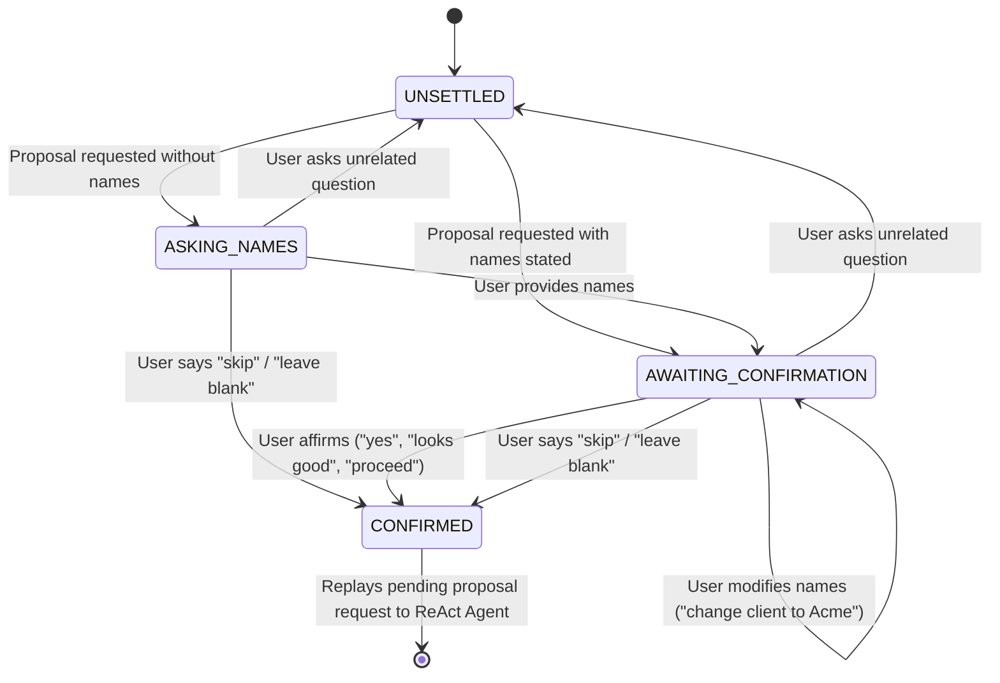

# Design: Proposal Generation Client & Project Name Confirmation

**Date:** 2026-08-15  
**Topic:** Proposal Naming Confirmation Workflow  
**Status:** Approved for Implementation  

---

## 1. Overview & Motivation

When a user asks the chatbot to generate a proposal (`REQUEST_PROPOSAL` intent), the system needs to determine the engagement naming details (`client_name` and `project_name`). Previously, when a user provided names in response to the initial prompt (or within the prompt), the system would immediately proceed to generate the proposal without confirming the extracted names.

This feature adds a deterministic confirmation step that explicitly displays the extracted names to the user:

```text
Confirming the following details:
Client Name: Clive
Project Name: Project Avisala

Are these the right details or do you want to change them?
```

The user can then:
1. **Confirm** (e.g., *"yes"*, *"looks good"*, *"correct"*, *"proceed"*) $\rightarrow$ Proceed to generate the proposal with the confirmed details.
2. **Change / Correct** (e.g., *"change client to Acme Corp"*, *"actually project is Beta"*) $\rightarrow$ Update details and present the confirmation block again.
3. **Skip / Decline** (e.g., *"skip"*, *"leave blank"*) $\rightarrow$ Clear names and proceed immediately to proposal generation.
4. **Ask an Unrelated Question** (e.g., *"What is Flutter?"*) $\rightarrow$ Abandon engagement ask and route the message as a fresh query.

---

## 2. Interaction Flows

### Flow A: Proposal Request without Names (Two-Step Input with Confirmation)
1. **User**: *"Generate a proposal for this attached brief"*
2. **Bot**: *"Before I put this together — is there a client name and project name you'd like on the proposal? Just say 'skip' to leave them blank; the proposal works either way."*
3. **User**: *"Client Name is Clive and Project name is Project Avisala"*
4. **Bot**:
   ```text
   Confirming the following details:
   Client Name: Clive
   Project Name: Project Avisala

   Are these the right details or do you want to change them?
   ```
5. **User**: *"Looks good, proceed"*
6. **Bot**: *(Replays proposal request to ReAct Agent, runs tools, generates proposal PDF with client 'Clive' and project 'Project Avisala')*

### Flow B: Correction Loop
1. **User**: *(During confirmation prompt)* *"Change client to Monica and project to Loyalty App"*
2. **Bot**:
   ```text
   Confirming the following details:
   Client Name: Monica
   Project Name: Loyalty App

   Are these the right details or do you want to change them?
   ```
3. **User**: *"Yes"*
4. **Bot**: *(Generates proposal with client 'Monica' and project 'Loyalty App')*

### Flow C: Upfront Names in Initial Prompt
1. **User**: *"Generate a proposal, client is Clive and project is Project Avisala"*
2. **Bot**:
   ```text
   Confirming the following details:
   Client Name: Clive
   Project Name: Project Avisala

   Are these the right details or do you want to change them?
   ```
3. **User**: *"Yes"*
4. **Bot**: *(Generates proposal)*

### Flow D: Missing / Partial Fields
If only one name is provided (e.g. only Client Name):
```text
Confirming the following details:
Client Name: Clive
Project Name: (Not specified)

Are these the right details or do you want to change them?
```

### Flow E: Declination / Skip
If the user says *"skip"* or *"leave blank"* at any point (initial ask or confirmation step), the bot immediately generates the proposal without further confirmation prompts.

---

## 3. Architecture & State Machine

### 3.1 `Engagement` State Model (`disambiguation/engagement.py`)

The `Engagement` dataclass tracks:
- `client_name: str | None = None`
- `project_name: str | None = None`
- `declined: bool = False`
- `asked: bool = False`
- `awaiting_confirmation: bool = False`
- `pending_request: str | None = None`
- `suggestion: tuple[str | None, str | None] = (None, None)`
- `loop: ClarificationLoop | None = None`

#### State Properties:
- `needs_ask(session_id)`: True when proposal requested, naming is not settled, not awaiting confirmation, and not currently asking.
- `needs_confirmation(session_id)`: True when `awaiting_confirmation` is True.
- `settled`: True when `declined` is True or (`asked` is True and not `awaiting_confirmation`).

### 3.2 State Transitions



---

## 4. Component Changes & Implementation Details

### 4.1 `src/stratpoint_rag/disambiguation/engagement.py`
- Add `format_confirmation(client_name: str | None, project_name: str | None) -> str`:
  ```python
  def format_confirmation(client_name: str | None, project_name: str | None) -> str:
      c = client_name or "(Not specified)"
      p = project_name or "(Not specified)"
      return (
          "Confirming the following details:\n"
          f"Client Name: {c}\n"
          f"Project Name: {p}\n\n"
          "Are these the right details or do you want to change them?"
      )
  ```
- Add `start_confirmation(session_id: str | None, request: str, client_name: str | None, project_name: str | None) -> str`:
  Sets `engagement.awaiting_confirmation = True`, `pending_request = request`, `client_name = client_name`, `project_name = project_name`, and returns `format_confirmation(...)`.
- Update `record_answer(session_id: str | None, answer: str) -> Resumption`:
  - When responding to the initial name question:
    - If user affirms document suggestion $\rightarrow$ transition to `awaiting_confirmation`, return confirmation prompt.
    - If user provides names $\rightarrow$ transition to `awaiting_confirmation`, return confirmation prompt.
    - If user declines $\rightarrow$ mark `declined = True`, return `Resumption(request=pending_request, ...)`.
  - When responding while `awaiting_confirmation = True`:
    - Add `record_confirmation_response(session_id: str | None, answer: str) -> tuple[Resumption, str | None]`:
      - If affirmative (*"yes"*, *"looks good"*, *"proceed"*): settle names, set `awaiting_confirmation = False, asked = True`, return `(Resumption(request=pending_request, ...), None)`.
      - If correction (*"change client to ..."* / new names given): update names in `Engagement`, keep `awaiting_confirmation = True`, return `(Resumption(...), format_confirmation(...))`.
      - If declination (*"skip"*, *"leave blank"*): clear names, set `declined = True, awaiting_confirmation = False`, return `(Resumption(request=pending_request, names=(None, None), declined=True), None)`.
      - If not an answer (e.g. user asks question): `abandon(session_id)`, return `(Resumption(request=answer, consumed=False), None)`.

### 4.2 `src/stratpoint_rag/disambiguation/slots.py`
- Enhance `_CLIENT_ANSWER` and `_PROJECT_ANSWER` patterns and `_extract_proposal_names()` to recognize:
  - `"change client (name)? to <val>"`
  - `"change project (name)? to <val>"`
  - `"make client <val>"`
  - `"actually client is <val>"` / `"actually project is <val>"`
  - `"client: <val>"` / `"project: <val>"`
  - `"client name is <val> and project name is <val>"`
- Enhance `_AFFIRM` pattern to include `"proceed"`, `"looks good"`, `"looks great"`, `"all good"`, `"confirm"`, `"confirmed"`.

### 4.3 `src/stratpoint_rag/agent/guardrail_agent.py`
- In `run_with_guardrails()`:
  - First, check if `engagement.get(session_id).awaiting_confirmation`:
    - Process response with `record_confirmation_response()`.
    - If re-confirmation needed $\rightarrow$ record turns to memory and return confirmation prompt as `AgentResult(answer=confirmation_prompt, guardrail_reason="Awaiting proposal details confirmation")`.
    - If confirmed or skipped $\rightarrow$ replay resumed request.
  - Second, check if `engagement.get(session_id).loop is not None`:
    - Process answer. If it returns a confirmation prompt $\rightarrow$ return confirmation prompt as `AgentResult`.
  - Third, upon routing `IntentCategory.REQUEST_PROPOSAL`:
    - If names were supplied upfront in request $\rightarrow$ trigger `start_confirmation(...)` and return confirmation prompt.
    - If names are missing $\rightarrow$ trigger `start_ask(...)` and return ask prompt.

---

## 5. File Dependencies & Affected Files

| File | Change |
|---|---|
| [`src/stratpoint_rag/disambiguation/engagement.py`](file:///C:/Users/seank/Desktop/ETC/DLSU/AA_STAI100_Stratpoint_RAG/src/stratpoint_rag/disambiguation/engagement.py) | Add confirmation state, formatting, and confirmation response handlers. |
| [`src/stratpoint_rag/disambiguation/slots.py`](file:///C:/Users/seank/Desktop/ETC/DLSU/AA_STAI100_Stratpoint_RAG/src/stratpoint_rag/disambiguation/slots.py) | Add regex patterns for change/correction phrasing and expanded affirmations. |
| [`src/stratpoint_rag/agent/guardrail_agent.py`](file:///C:/Users/seank/Desktop/ETC/DLSU/AA_STAI100_Stratpoint_RAG/src/stratpoint_rag/agent/guardrail_agent.py) | Wire confirmation handling into orchestrator flow. |
| [`docs/ARCHITECTURE.md`](file:///C:/Users/seank/Desktop/ETC/DLSU/AA_STAI100_Stratpoint_RAG/docs/ARCHITECTURE.md) | Document confirmation step in the engagement naming section. |
| [`CLAUDE.md`](file:///C:/Users/seank/Desktop/ETC/DLSU/AA_STAI100_Stratpoint_RAG/CLAUDE.md) | Update proposal naming flow description. |
| [`tests/test_engagement_names.py`](file:///C:/Users/seank/Desktop/ETC/DLSU/AA_STAI100_Stratpoint_RAG/tests/test_engagement_names.py) | Unit tests for confirmation, correction, and declination. |
| [`tests/test_guardrail_brief_flow.py`](file:///C:/Users/seank/Desktop/ETC/DLSU/AA_STAI100_Stratpoint_RAG/tests/test_guardrail_brief_flow.py) | Multi-turn integration tests for full confirmation flow. |

---

## 6. Testing & Validation Strategy

1. **Unit Tests (`pytest tests/test_engagement_names.py`)**:
   - `test_confirmation_prompt_formatting`: Validate format with both names, one name, and none.
   - `test_names_in_initial_request_trigger_confirmation`: Upfront prompt $\rightarrow$ confirmation prompt.
   - `test_answer_to_ask_triggers_confirmation`: User gives names $\rightarrow$ confirmation prompt.
   - `test_confirmation_affirmation_proceeds_to_generation`: `"yes"` / `"looks good"` $\rightarrow$ settles and replays.
   - `test_confirmation_correction_updates_and_reconfirms`: `"change client to Acme"` $\rightarrow$ new confirmation prompt.
   - `test_confirmation_skip_clears_and_proceeds`: `"skip"` $\rightarrow$ settles with `(None, None)` and replays.
2. **Integration Tests (`pytest tests/test_guardrail_brief_flow.py`)**:
   - Full 3-turn and 4-turn dialogues through `run_with_guardrails()` with mocked `run_agent` assertions on passed names.
3. **Regression Testing (`uv run pytest`)**:
   - Verify entire test suite passes without regressions.
